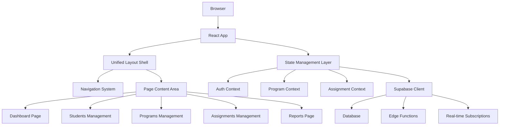

# Design Document

## Overview

The Meeting Management System will be a comprehensive solution for managing Christian Life and Ministry Meeting assignments, built on the existing React + TypeScript + Supabase architecture. The system addresses the current navigation and organization issues by implementing a unified layout with consistent routing, shared components, and centralized state management.

The design leverages the existing infrastructure including Supabase for data persistence, shadcn/ui for consistent styling, and React Router for navigation, while introducing a new unified layout system that eliminates the disorganized page structure.

## Architecture

### High-Level Architecture



### Component Hierarchy

```
App
├── AuthProvider
├── LanguageProvider
├── ProgramProvider
├── AssignmentProvider (new)
└── BrowserRouter
    └── UnifiedLayout (new)
        ├── UnifiedNavigation (enhanced)
        ├── UnifiedBreadcrumbs
        └── PageContent
            ├── DashboardPage
            ├── StudentsPage
            ├── ProgramsPage
            ├── AssignmentsPage
            └── ReportsPage
```

## Components and Interfaces

### Core Layout Components

#### UnifiedLayout Component
```typescript
interface UnifiedLayoutProps {
  children: React.ReactNode;
}

interface NavigationItem {
  path: string;
  label: string;
  icon: React.ComponentType;
  roles: UserRole[];
  exact?: boolean;
}
```

The UnifiedLayout component will serve as the main shell, providing:
- Consistent sidebar navigation
- Responsive design for mobile/desktop
- Role-based navigation filtering
- Breadcrumb navigation
- Global notifications area

#### Enhanced Navigation System
Building on the existing UnifiedNavigation component, the navigation will be enhanced to:
- Support nested routes with breadcrumbs
- Provide visual indicators for active sections
- Include quick action buttons for common tasks
- Display assignment status indicators

### Page Components

#### Dashboard Page
```typescript
interface DashboardData {
  upcomingAssignments: Assignment[];
  studentAvailability: StudentAvailability[];
  programStatus: ProgramStatus;
  recentActivity: Activity[];
}
```

Centralized overview showing:
- Current week's assignments
- Student availability status
- Program preparation progress
- Quick access to common actions

#### Students Management Page
Enhanced version of existing EstudantesPage with:
- Unified student grid with filtering
- Family relationship management
- Qualification tracking
- Assignment history view

#### Programs Management Page
Enhanced version of existing ProgramasPage with:
- Program upload and parsing
- Weekly program display
- Assignment template generation
- Material resource links

#### Assignments Management Page
Enhanced version of existing DesignacoesPage with:
- Assignment generation engine
- Real-time editing capabilities
- S-38 rule validation
- Conflict resolution tools

#### Reports Page
Enhanced version of existing RelatoriosPage with:
- Participation analytics
- Assignment distribution reports
- Student progress tracking
- Export capabilities

### Data Models

#### Enhanced Assignment Model
```typescript
interface Assignment {
  id: string;
  programId: string;
  studentId: string;
  assistantId?: string;
  partType: PartType;
  studyPoint: string;
  weekDate: Date;
  status: AssignmentStatus;
  counselNotes?: string;
  timing?: number;
  createdAt: Date;
  updatedAt: Date;
}

enum PartType {
  BIBLE_READING = 'bible_reading',
  STARTING_CONVERSATION = 'starting_conversation',
  FOLLOWING_UP = 'following_up',
  MAKING_DISCIPLES = 'making_disciples',
  EXPLAINING_BELIEFS = 'explaining_beliefs',
  TALK = 'talk'
}

enum AssignmentStatus {
  PENDING = 'pending',
  CONFIRMED = 'confirmed',
  COMPLETED = 'completed',
  CANCELLED = 'cancelled'
}
```

#### Student Qualification Model
```typescript
interface StudentQualifications {
  id: string;
  studentId: string;
  canGiveTalks: boolean;
  canDoDemonstrations: boolean;
  canAssist: boolean;
  genderRestrictions: GenderRestriction[];
  experienceLevel: ExperienceLevel;
  lastAssignmentDate?: Date;
  assignmentCount: number;
}
```

#### Program Structure Model
```typescript
interface MeetingProgram {
  id: string;
  weekDate: Date;
  treasuresSection: TreasuresSection;
  ministrySection: MinistrySection;
  livingSection: LivingSection;
  isActive: boolean;
  uploadedBy: string;
  createdAt: Date;
}

interface MinistrySection {
  parts: MinistryPart[];
  totalTime: number;
}

interface MinistryPart {
  id: string;
  title: string;
  type: PartType;
  timeAllotted: number;
  studyPoint: string;
  genderRequirement: GenderRequirement;
  assistantRequired: boolean;
}
```

## Error Handling

### Client-Side Error Handling
- Implement error boundaries for each major page section
- Provide user-friendly error messages with recovery options
- Log errors to Supabase for monitoring
- Implement offline fallback for critical functionality

### Server-Side Error Handling
- Validate all assignment rules before saving
- Provide detailed validation error messages
- Implement retry logic for network failures
- Handle concurrent assignment conflicts

### Assignment Validation Errors
```typescript
interface ValidationError {
  field: string;
  message: string;
  severity: 'error' | 'warning';
  suggestion?: string;
}

interface AssignmentValidationResult {
  isValid: boolean;
  errors: ValidationError[];
  warnings: ValidationError[];
}
```

## Testing Strategy

### Unit Testing
- Test assignment generation algorithms
- Validate S-38 rule enforcement
- Test data transformation utilities
- Mock Supabase interactions for isolated testing

### Integration Testing
- Test complete assignment workflow
- Validate real-time updates
- Test role-based access control
- Verify data consistency across components

### End-to-End Testing
- Test complete user workflows (instructor creating assignments)
- Validate responsive design across devices
- Test offline functionality
- Verify accessibility compliance

### Performance Testing
- Load testing with large student datasets
- Assignment generation performance benchmarks
- Real-time update latency testing
- Mobile performance optimization

## Security Considerations

### Authentication & Authorization
- Leverage existing Supabase RLS policies
- Implement role-based component rendering
- Secure API endpoints with proper authentication
- Validate user permissions for all operations

### Data Protection
- Encrypt sensitive student information
- Implement audit logging for all changes
- Secure file uploads for program materials
- Regular security updates and dependency scanning

## Accessibility Features

### WCAG 2.1 Compliance
- Keyboard navigation support
- Screen reader compatibility
- High contrast mode support
- Focus management for dynamic content

### Responsive Design
- Mobile-first approach
- Touch-friendly interface elements
- Adaptive layouts for different screen sizes
- Progressive enhancement for advanced features

## Performance Optimizations

### Code Splitting
- Lazy load page components
- Split vendor bundles
- Dynamic imports for heavy features
- Service worker for caching

### Data Management
- Implement efficient caching strategies
- Use React Query for server state management
- Optimize database queries with proper indexing
- Implement pagination for large datasets

### Real-time Features
- Selective Supabase subscriptions
- Debounced updates for frequent changes
- Optimistic UI updates
- Connection status monitoring

## Migration Strategy

### Phase 1: Layout Unification
- Implement UnifiedLayout component
- Migrate existing pages to new layout
- Update navigation system
- Ensure backward compatibility

### Phase 2: Enhanced Features
- Implement assignment generation engine
- Add real-time collaboration features
- Enhance reporting capabilities
- Improve mobile experience

### Phase 3: Advanced Features
- Add offline support
- Implement advanced analytics
- Add multi-congregation support
- Performance optimizations

## Technical Debt Resolution

### Current Issues to Address
- Inconsistent navigation between pages
- Duplicate component logic
- Scattered state management
- Inconsistent error handling

### Proposed Solutions
- Centralize navigation logic in UnifiedLayout
- Create shared component library
- Implement centralized state management
- Standardize error handling patterns