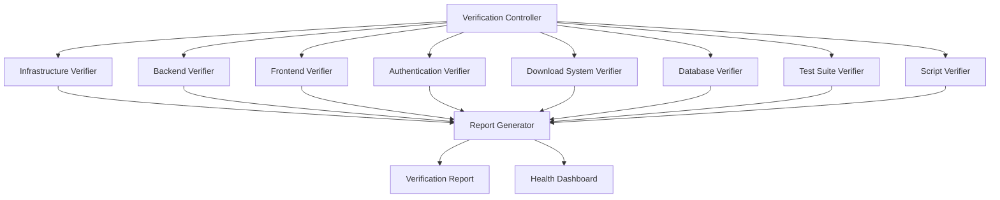

# Design Document

## Overview

The Sistema Ministerial Verification System is designed as a comprehensive testing and validation framework that systematically verifies all components of the Sistema Ministerial platform. The system will perform automated checks across multiple layers including infrastructure, backend services, frontend application, authentication, database integration, and testing frameworks.

The verification system follows a modular architecture where each component can be tested independently while also supporting full system integration testing. The design emphasizes automated execution, detailed reporting, and clear remediation guidance for any identified issues.

## Architecture

### High-Level Architecture



### Component Architecture

The system is organized into distinct verification modules:

1. **Verification Controller**: Orchestrates the entire verification process
2. **Infrastructure Verifier**: Validates dependencies, configuration, and environment setup
3. **Backend Verifier**: Tests Node.js server, APIs, and services
4. **Frontend Verifier**: Validates React application and user interface components
5. **Authentication Verifier**: Tests user authentication and role-based access control
6. **Download System Verifier**: Validates JW.org integration and material download functionality
7. **Database Verifier**: Tests Supabase integration and data operations
8. **Test Suite Verifier**: Executes and validates all Cypress tests
9. **Script Verifier**: Tests all npm scripts and development workflows
10. **Report Generator**: Compiles results and generates comprehensive reports

## Components and Interfaces

### Verification Controller

**Purpose**: Central orchestrator that manages the verification workflow and coordinates all verification modules.

**Key Methods**:
- `runFullVerification()`: Executes complete system verification
- `runModuleVerification(module)`: Executes specific module verification
- `generateReport()`: Compiles and generates final verification report

**Interfaces**:
```typescript
interface VerificationController {
  runFullVerification(): Promise<VerificationResult>
  runModuleVerification(module: VerificationModule): Promise<ModuleResult>
  generateReport(results: VerificationResult[]): Promise<VerificationReport>
}
```

### Infrastructure Verifier

**Purpose**: Validates that all required dependencies, configurations, and environment variables are properly set up.

**Key Validations**:
- Package.json files existence and content validation
- Node.js and npm version compatibility
- Environment variables presence and format
- Directory structure verification
- File permissions and access rights

**Interfaces**:
```typescript
interface InfrastructureVerifier {
  checkDependencies(): Promise<DependencyResult>
  validateEnvironment(): Promise<EnvironmentResult>
  verifyDirectoryStructure(): Promise<StructureResult>
}
```

### Backend Verifier

**Purpose**: Comprehensive testing of the Node.js backend server, APIs, and all backend services.

**Key Validations**:
- Server startup and port binding
- API endpoint accessibility and response validation
- Service initialization (JWDownloader, ProgramGenerator, MaterialManager)
- Cron job configuration and scheduling
- Error handling and logging functionality

**Interfaces**:
```typescript
interface BackendVerifier {
  startServer(): Promise<ServerResult>
  testAPIEndpoints(): Promise<APIResult[]>
  validateServices(): Promise<ServiceResult[]>
  testCronJobs(): Promise<CronResult>
}
```

### Frontend Verifier

**Purpose**: Validates the React frontend application, routing, and user interface components.

**Key Validations**:
- Application startup and compilation
- Route accessibility and navigation
- Component rendering and functionality
- Backend API integration
- Console error detection and reporting

**Interfaces**:
```typescript
interface FrontendVerifier {
  startApplication(): Promise<AppResult>
  testRouting(): Promise<RoutingResult[]>
  validateComponents(): Promise<ComponentResult[]>
  testBackendIntegration(): Promise<IntegrationResult>
}
```

### Authentication Verifier

**Purpose**: Comprehensive testing of the authentication system across all user roles and access levels.

**Key Validations**:
- User login functionality for each role (admin, instructor, student)
- Role-based access control enforcement
- Session management and persistence
- Password reset and recovery functionality
- Supabase Auth integration

**Interfaces**:
```typescript
interface AuthenticationVerifier {
  testUserLogin(role: UserRole): Promise<LoginResult>
  validateRoleAccess(role: UserRole): Promise<AccessResult>
  testSessionManagement(): Promise<SessionResult>
  validateSupabaseAuth(): Promise<SupabaseAuthResult>
}
```

### Download System Verifier

**Purpose**: Validates the JW.org integration and automatic material download functionality.

**Key Validations**:
- JW.org URL configuration and accessibility
- Material detection and parsing
- Download functionality and file handling
- File organization and storage
- Cron job scheduling for automatic downloads

**Interfaces**:
```typescript
interface DownloadSystemVerifier {
  validateJWOrgIntegration(): Promise<JWOrgResult>
  testMaterialDetection(): Promise<DetectionResult>
  validateDownloadFunctionality(): Promise<DownloadResult>
  testFileOrganization(): Promise<OrganizationResult>
}
```

### Database Verifier

**Purpose**: Comprehensive testing of Supabase database integration and data operations.

**Key Validations**:
- Database connection and authentication
- CRUD operations for all entities
- Row Level Security (RLS) policy enforcement
- Migration status and schema validation
- Data integrity and constraints

**Interfaces**:
```typescript
interface DatabaseVerifier {
  testConnection(): Promise<ConnectionResult>
  validateCRUDOperations(): Promise<CRUDResult[]>
  testRLSPolicies(): Promise<RLSResult[]>
  validateMigrations(): Promise<MigrationResult>
}
```

### Test Suite Verifier

**Purpose**: Executes and validates all Cypress end-to-end tests to ensure comprehensive test coverage.

**Key Validations**:
- Cypress installation and configuration
- Individual test execution and results
- Test coverage analysis
- Performance and timing validation
- Test environment setup and teardown

**Interfaces**:
```typescript
interface TestSuiteVerifier {
  validateCypressSetup(): Promise<CypressSetupResult>
  runAllTests(): Promise<TestResult[]>
  analyzeTestCoverage(): Promise<CoverageResult>
  validateTestEnvironment(): Promise<TestEnvResult>
}
```

### Script Verifier

**Purpose**: Tests all npm scripts and development workflows to ensure proper functionality.

**Key Validations**:
- Script execution and exit codes
- Development workflow validation
- Build process verification
- Environment script functionality
- Error handling and logging

**Interfaces**:
```typescript
interface ScriptVerifier {
  testDevelopmentScripts(): Promise<ScriptResult[]>
  validateBuildProcess(): Promise<BuildResult>
  testEnvironmentScripts(): Promise<EnvScriptResult[]>
  validateWorkflows(): Promise<WorkflowResult>
}
```

## Data Models

### Verification Result Models

```typescript
interface VerificationResult {
  module: string
  status: 'PASS' | 'FAIL' | 'WARNING'
  timestamp: Date
  duration: number
  details: VerificationDetail[]
  errors?: Error[]
  warnings?: Warning[]
}

interface VerificationDetail {
  component: string
  test: string
  result: 'PASS' | 'FAIL' | 'WARNING'
  message: string
  data?: any
}

interface VerificationReport {
  overallStatus: 'HEALTHY' | 'ISSUES_FOUND' | 'CRITICAL_FAILURES'
  timestamp: Date
  totalDuration: number
  summary: VerificationSummary
  moduleResults: VerificationResult[]
  recommendations: Recommendation[]
}

interface VerificationSummary {
  totalTests: number
  passed: number
  failed: number
  warnings: number
  criticalIssues: number
}

interface Recommendation {
  severity: 'LOW' | 'MEDIUM' | 'HIGH' | 'CRITICAL'
  component: string
  issue: string
  solution: string
  documentation?: string
}
```

## Error Handling

### Error Classification

1. **Critical Errors**: System cannot function (server won't start, database unreachable)
2. **High Priority Errors**: Major functionality broken (authentication fails, APIs non-responsive)
3. **Medium Priority Errors**: Some features impacted (specific tests failing, performance issues)
4. **Low Priority Warnings**: Minor issues or recommendations (outdated dependencies, style issues)

### Error Recovery Strategies

- **Retry Logic**: Automatic retry for transient failures (network timeouts, temporary service unavailability)
- **Graceful Degradation**: Continue verification even if non-critical components fail
- **Detailed Logging**: Comprehensive error logging with context and stack traces
- **Remediation Guidance**: Specific instructions for resolving identified issues

### Error Reporting

```typescript
interface ErrorReport {
  errorId: string
  severity: ErrorSeverity
  component: string
  message: string
  stackTrace?: string
  context: Record<string, any>
  timestamp: Date
  remediation: RemediationStep[]
}

interface RemediationStep {
  step: number
  description: string
  command?: string
  expectedResult: string
  documentation?: string
}
```

## Testing Strategy

### Unit Testing

- Individual verification module testing
- Mock external dependencies (Supabase, JW.org)
- Test error handling and edge cases
- Validate data models and interfaces

### Integration Testing

- End-to-end verification workflow testing
- Real service integration testing
- Database operation validation
- API integration testing

### Performance Testing

- Verification execution time monitoring
- Resource usage tracking
- Concurrent operation testing
- Scalability validation

### Test Data Management

- Test environment setup and teardown
- Mock data generation for testing
- Test isolation and cleanup
- Consistent test state management

## Implementation Phases

### Phase 1: Core Infrastructure
- Verification Controller implementation
- Basic reporting framework
- Infrastructure and environment verification
- Error handling foundation

### Phase 2: Service Verification
- Backend service verification
- Frontend application verification
- Database integration testing
- Basic authentication testing

### Phase 3: Advanced Features
- Download system verification
- Comprehensive authentication testing
- Test suite integration
- Script and workflow validation

### Phase 4: Reporting and Monitoring
- Advanced reporting features
- Health dashboard implementation
- Performance monitoring
- Automated remediation suggestions

## Security Considerations

### Authentication Security
- Secure handling of test credentials
- Temporary token management
- Role-based access validation
- Session security testing

### Data Protection
- Sensitive data masking in reports
- Secure storage of verification results
- Access control for verification reports
- Audit trail maintenance

### Network Security
- Secure API communication testing
- SSL/TLS validation
- Network timeout handling
- Firewall and port configuration validation

## Performance Requirements

### Execution Time
- Full verification should complete within 10 minutes
- Individual module verification within 2 minutes
- Real-time progress reporting
- Parallel execution where possible

### Resource Usage
- Memory usage monitoring and limits
- CPU usage optimization
- Network bandwidth consideration
- Disk space management for reports

### Scalability
- Support for multiple concurrent verifications
- Modular execution for selective testing
- Configurable timeout and retry settings
- Efficient resource cleanup