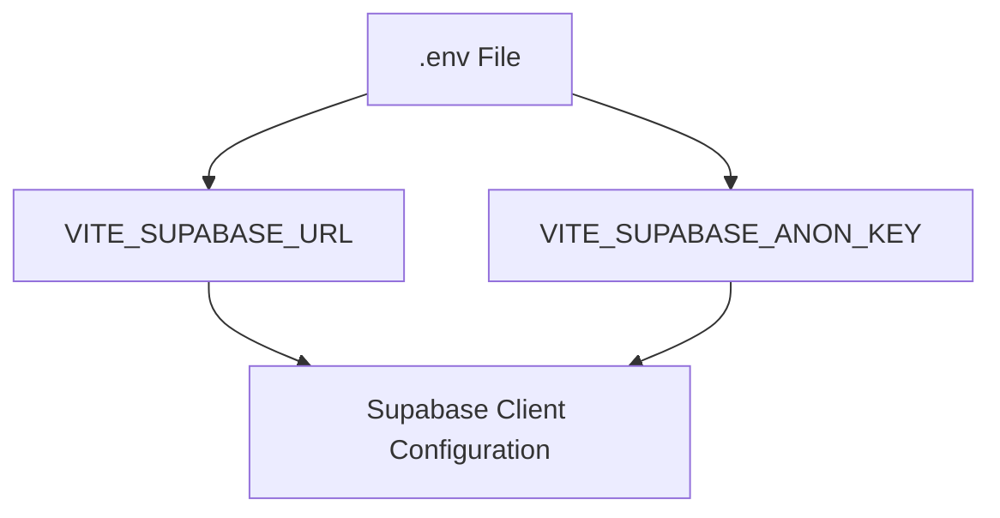
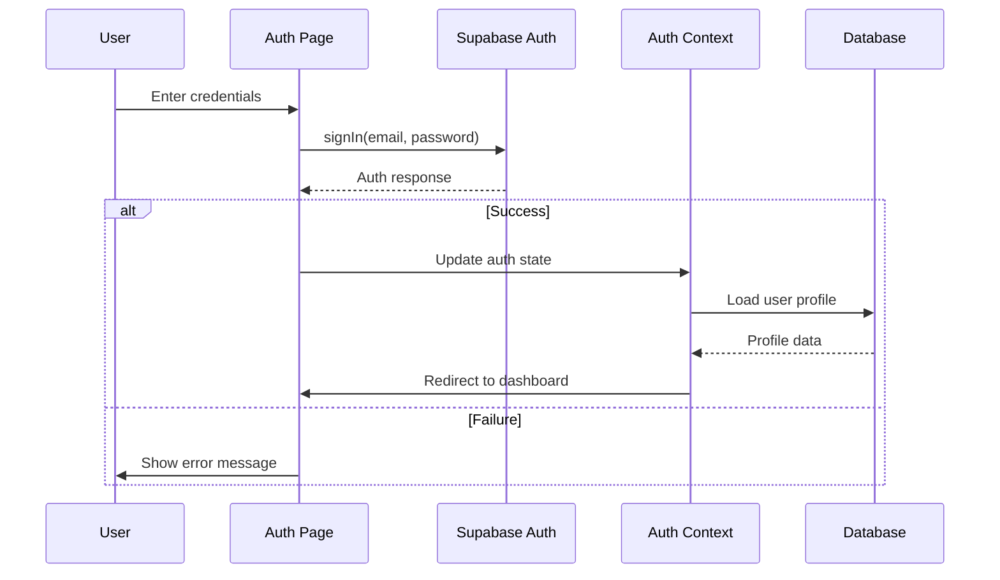

# Supabase Configuration Design Document

## 1. Overview

This document outlines the design and implementation plan for resolving Supabase configuration issues in the Sistema Ministerial application. The primary problems identified are:

1. **Missing Environment Variables**: The application expects `VITE_SUPABASE_URL` and `VITE_SUPABASE_ANON_KEY`, but the current configuration uses `VITE_SUPABASE_PUBLISHABLE_KEY`.
2. **Duplicate Supabase Clients**: Two separate Supabase client configurations exist in the codebase (`src/lib/supabase.ts` and `src/integrations/supabase/client.ts`).
3. **Authentication Issues**: No valid users exist in the Supabase authentication system, causing login failures.
4. **Routing Configuration**: The default route does not properly redirect to the authentication page.

## 2. Current Architecture

### 2.1 Frontend Supabase Configuration

The frontend currently has two Supabase client configurations:

1. **Primary Client**: `src/integrations/supabase/client.ts`
   - Hardcoded Supabase URL and publishable key
   - Used by the AuthContext for authentication operations

2. **Re-export Client**: `src/lib/supabase.ts`
   - Re-exports the primary client
   - Creates redundancy in the configuration

### 22.2 Environment Variables

The `.env.example` file specifies the expected environment variables:
- `VITE_SUPABASE_URL`: The Supabase project URL
- `VITE_SUPABASE_ANON_KEY`: The anonymous/public key for frontend authentication

However, the actual implementation uses hardcoded values instead of environment variables.

### 2.3 Authentication Flow

The authentication system uses:
- Supabase Auth for user management
- Custom AuthContext for state management
- ProtectedRoute components for access control
- User profiles stored in the `profiles` table

## 3. Proposed Solution Architecture

### 3.1 Environment Variable Standardization



### 3.2 Supabase Client Consolidation

The solution involves:
1. Removing the redundant `src/lib/supabase.ts` file
2. Updating `src/integrations/supabase/client.ts` to use environment variables
3. Ensuring all imports reference the single client file

### 3.3 Authentication Enhancement

The solution includes:
1. Creating test users in Supabase
2. Ensuring proper routing from root to authentication page
3. Implementing proper error handling for authentication failures

## 4. Implementation Plan

### 4.1 Environment Variable Configuration

#### 4.1.1 Update .env File
Create a `.env` file in the project root with the following content:

```env
VITE_SUPABASE_URL=https://<SEU-PROJETO>.supabase.co
VITE_SUPABASE_ANON_KEY=<SUA-CHAVE-ANON>
```

#### 4.1.2 Update Supabase Client
Modify `src/integrations/supabase/client.ts` to use environment variables:

```typescript
import { createClient } from '@supabase/supabase-js';
import type { Database } from './types';

const supabaseUrl = import.meta.env.VITE_SUPABASE_URL;
const supabaseAnonKey = import.meta.env.VITE_SUPABASE_ANON_KEY;

if (!supabaseUrl) throw new Error('Missing VITE_SUPABASE_URL');
if (!supabaseAnonKey) throw new Error('Missing VITE_SUPABASE_ANON_KEY');

export const supabase = createClient<Database>(supabaseUrl, supabaseAnonKey, {
  auth: {
    storage: localStorage,
    persistSession: true,
    autoRefreshToken: true,
  }
});
```

### 4.2 Client Consolidation

#### 4.2.1 Remove Redundant File
Delete `src/lib/supabase.ts` as it only re-exports the main client.

#### 4.2.2 Update Imports
Replace all imports from `@/lib/supabase` to `@/integrations/supabase/client`.

### 4.3 Authentication Setup

#### 4.3.1 Create Test Users
In the Supabase dashboard, create the following test users:

| Role | Email | Password |
|------|-------|----------|
| Instructor | frankwebber33@hotmail.com | 13a21r15 |
| Student | franklinmarceloferreiradelima@gmail.com | 13a21r15 |

#### 4.3.2 Update Routing
Ensure the root route redirects to the authentication page in `src/App.tsx`:

```tsx
<Route path="/" element={<Navigate to="/auth" replace />} />
<Route path="/auth" element={<Auth />} />
```

## 5. Data Models

### 5.1 User Profile Model

The user profile structure in the database:

| Field | Type | Description |
|-------|------|-------------|
| id | UUID | Primary key |
| user_id | UUID | Foreign key to auth.users |
| nome | TEXT | User's full name |
| email | TEXT | User's email |
| role | TEXT | User role (admin, instrutor, estudante) |
| congregacao_id | UUID | Foreign key to congregations |
| created_at | TIMESTAMP | Record creation timestamp |
| updated_at | TIMESTAMP | Record update timestamp |

### 5.2 Authentication Flow



## 6. Security Considerations

### 6.1 Environment Variables
- Environment variables must not be committed to version control
- Use different keys for development, staging, and production environments
- The `.env.example` file should document all required variables

### 6.2 Supabase Keys
- Use anonymous keys for frontend operations
- Restrict backend operations with service role keys
- Implement Row Level Security (RLS) policies in the database

### 6.3 User Management
- Implement proper password policies
- Use Supabase Auth built-in security features
- Regularly audit user accounts and permissions

## 7. Testing Strategy

### 7.1 Unit Tests
- Test Supabase client initialization with missing environment variables
- Test authentication flow with valid and invalid credentials
- Test profile loading and error handling

### 7.2 Integration Tests
- Test the complete authentication flow from login to dashboard
- Test role-based access control for different user types
- Test session persistence and token refresh

### 7.3 End-to-End Tests
- Test the login page functionality
- Test user registration flow
- Test navigation restrictions for authenticated routes

## 8. Deployment Considerations

### 8.1 Environment Configuration
- Set environment variables in deployment platform (Vercel, Netlify, etc.)
- Ensure proper CORS configuration for frontend-backend communication
- Configure Supabase authentication settings

### 8.2 Migration Plan
1. Update environment variables in all environments
2. Deploy updated client configuration
3. Create required test users
4. Verify authentication flow works correctly
5. Update documentation with new configuration requirements

## 9. Monitoring and Maintenance

### 9.1 Error Monitoring
- Implement error tracking for authentication failures
- Monitor Supabase client initialization errors
- Track user login/logout events

### 9.2 Performance Monitoring
- Monitor authentication API response times
- Track session duration and refresh patterns
- Monitor database query performance for profile loading

### 9.3 Maintenance Tasks
- Regular review of user accounts and permissions
- Update Supabase keys when they expire
- Audit authentication logs for suspicious activity