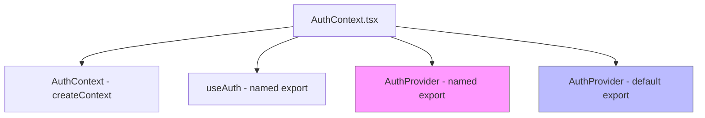
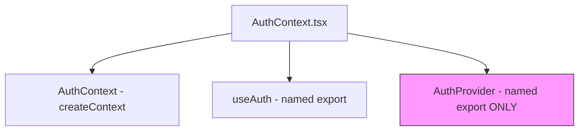

# Authentication Module Export Error Resolution

## Overview

This document addresses the error `auth-DmDE_EAW.js:1 Uncaught SyntaxError: Export 'AuthProvider' is not defined in module (at auth-DmDE_EAW.js:1:215)` which occurs during the application build process. The error indicates that the `AuthProvider` component is being referenced but not properly exported from the authentication module.

## Problem Analysis

Based on the code analysis, the error occurs due to module resolution issues during the build process with Vite and Rollup. The specific issues are:

1. In `src/contexts/AuthContext.tsx`, both named export (`export const AuthProvider`) and default export (`export default AuthProvider`) are defined
2. In `src/App.tsx`, the component is imported using a named import (`import { AuthProvider } from "@/contexts/AuthContext"`)
3. The Vite configuration in `vite.config.ts` has manual chunking that separates the auth module into its own chunk
4. During the build process, there's a conflict in how the exports are being resolved in the generated JavaScript bundle

## Solution Design

### 1. Fix Export Consistency

The primary issue is the dual export pattern in `AuthContext.tsx`. We need to standardize the export approach:

```typescript
// Current problematic pattern
export const AuthProvider = (...) => {...};
export default AuthProvider;
```

This creates ambiguity in module resolution, especially when chunking is involved.

### 2. Update Import Pattern

All imports should consistently use either named or default imports, but not mix them.

### 3. Revise Build Configuration

The manual chunking configuration in `vite.config.ts` needs to be adjusted to ensure proper module resolution.

## Implementation Strategy

### Phase 1: Export Standardization

1. Modify `AuthContext.tsx` to use only named exports
2. Remove the default export to eliminate ambiguity
3. Ensure all references use named imports

### Phase 2: Import Consistency

1. Audit all imports of `AuthContext.tsx` across the codebase
2. Standardize on named imports: `import { AuthProvider, useAuth } from "@/contexts/AuthContext"`
3. Remove any default import patterns

### Phase 3: Build Configuration Optimization

1. Review the manual chunking configuration in `vite.config.ts`
2. Ensure the auth chunk properly includes all necessary dependencies
3. Add explicit handling for context modules

## Technical Details

### AuthContext Module Structure

The current `AuthContext.tsx` file has the following export structure:



The dual export of `AuthProvider` (both named and default) creates the conflict during module resolution.

### Proposed Resolution



## Implementation Steps

### Step 1: Modify AuthContext.tsx

1. Remove the default export statement
2. Keep only the named export for `AuthProvider`
3. Ensure all internal references are consistent

### Step 2: Update All Import Statements

1. Audit all files that import from `@/contexts/AuthContext`
2. Ensure they use named imports: `import { AuthProvider, useAuth } from "@/contexts/AuthContext"`
3. Remove any default import patterns: `import AuthProvider from "@/contexts/AuthContext"`

### Step 3: Adjust Vite Configuration

1. Review the manualChunks configuration in `vite.config.ts`
2. Ensure proper dependency resolution for the auth chunk
3. Consider adding explicit module resolution hints if needed

## Code Changes

### AuthContext.tsx Modification

The specific change needed in `src/contexts/AuthContext.tsx` is to remove the default export at the end of the file:

```diff
- export default AuthProvider;
```

The existing named export should remain:

```typescript
export const AuthProvider: React.FC<{ children: React.ReactNode }> = ({ children }) => {
  // ... implementation
};

export const useAuth = () => {
  // ... implementation
};
```

This ensures that only named exports are available, eliminating the ambiguity that causes the build error.

### App.tsx Update

In `src/App.tsx`, the import pattern needs to be updated from default import to named import:

```diff
- import AuthProvider from "@/contexts/AuthContext"; // Changed from named import to default import
+ import { AuthProvider } from "@/contexts/AuthContext";
```

### Test Files Update

The following test files also need to be checked and updated if they use default imports:

1. `test-app-syntax.tsx` - Already using named import (no change needed)
2. `test-auth-provider.js` - Already using named import (no change needed)

### Vite Configuration Review

The current manual chunking configuration in `vite.config.ts` separates auth-related modules:

```typescript
'auth': ['src/contexts/AuthContext.tsx', 'src/utils/auth-recovery.ts'],
```

This configuration should work correctly with the named export approach.

## Risk Mitigation

### Potential Issues

1. **Breaking Changes**: Removing the default export might break existing imports
2. **Build Failures**: Incorrect import patterns might cause build errors
3. **Runtime Errors**: Inconsistent import/export patterns might cause runtime issues

### Mitigation Strategies

1. **Comprehensive Testing**: Test all authentication flows after changes
2. **Gradual Rollout**: Implement changes in a development branch first
3. **Backup Plan**: Keep a copy of the original implementation for rollback

## Validation and Testing

### Implementation Verification

After making the changes, verify the solution works by:

1. Running the development server: `npm run dev`
2. Building the application: `npm run build`
3. Checking that no export errors occur during the build process
4. Testing authentication flows in the browser

### Test Cases

1. **Build Test**: Verify the application builds successfully without the export error
2. **Authentication Test**: Test user login and logout functionality
3. **Context Test**: Ensure the AuthProvider correctly provides context to child components
4. **Import Test**: Verify all files that import AuthProvider work correctly

### Automated Testing

Run the existing test suite to ensure no regressions:

```bash
npm run test
npm run test:auth
npm run cypress:run
```

## Validation Criteria

The solution will be considered successful when:

1. The build process completes without the export error
2. All authentication functionality works as expected
3. No runtime errors occur related to authentication context
4. All existing tests pass
5. User authentication flows work correctly in both development and production builds

## Rollback Plan

If issues arise after implementation:

1. Revert the export changes in `AuthContext.tsx`
2. Restore the default export
3. Revert any import statement changes
4. Return to the previous Vite configuration

## Summary

The authentication module export error occurs due to conflicting export patterns in the `AuthContext.tsx` file. By standardizing on named exports only and updating all import statements to use named imports consistently, we can resolve the module resolution ambiguity that causes the build error. This approach maintains all existing functionality while ensuring compatibility with the Vite build process and manual chunking configuration.
