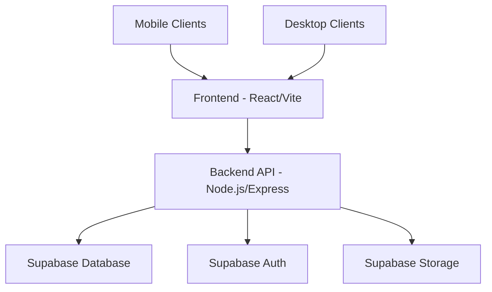

# Sistema Ministerial - Technical Design Document

## 1. Overview

The Sistema Ministerial is a comprehensive system for managing ministerial assignments within Jehovah's Witnesses congregations, following the official S-38 guidelines. The system streamlines the process of student management, automatic assignment generation, and reporting for theocratic ministry school programs.

### 1.1 Purpose
The system aims to:
- Automate the assignment of students to parts in the Theocratic Ministry School
- Provide persistent tracking for student qualifications and participation history
- Enable offline functionality for areas with limited internet connectivity
- Process official Watchtower PDF publications for program creation
- Generate rule-based assignments following S-38 guidelines

### 1.2 Key Features
- Authentication with Supabase Auth
- Persistent data storage in Supabase database
- Automatic assignment generation based on S-38 rules
- PDF upload and processing from Watchtower publications
- Advanced reporting and dashboards
- Complete offline functionality
- Qualification tracking system for students

## 2. Architecture

The system follows a client-server architecture with a React frontend and Node.js/Express backend, both communicating with a Supabase backend-as-a-service.



### 2.1 Frontend Architecture
The frontend is built with React and TypeScript using Vite as the build tool. It follows a component-based architecture with:
- Context API for state management
- React Router for navigation
- Supabase client for data operations
- Tailwind CSS for styling
- shadcn/ui components for UI elements

### 2.2 Backend Architecture
The backend is a Node.js/Express application that serves as an API layer between the frontend and Supabase. It includes:
- RESTful API endpoints
- Business logic for assignment generation
- PDF processing services
- Authentication middleware
- Data validation and transformation

### 2.3 Data Layer
The system uses Supabase as its primary data layer with:
- PostgreSQL database with Row Level Security (RLS)
- Authentication service
- Storage for PDF documents
- Real-time subscriptions

## 3. Component Architecture

### 3.1 Frontend Components

#### 3.1.1 Authentication System
The authentication system consists of:
- AuthContext for managing user state
- ProtectedRoute components for role-based access control
- Login/Signup forms with form validation
- Password visibility toggle functionality

#### 3.1.2 Student Management
Student management includes:
- Student listing with filtering capabilities
- Student creation/editing forms
- Spreadsheet import functionality
- Student qualification tracking
- Family relationship management

#### 3.1.3 Program Management
Program management features:
- PDF upload and processing
- Program listing and selection
- Program detail views
- Integration with JW.org materials

#### 3.1.4 Assignment System
The assignment system provides:
- Automatic assignment generation using S-38 rules
- Manual assignment adjustment capabilities
- Assignment validation against S-38 guidelines
- Assignment history tracking

#### 3.1.5 Reporting System
Reporting includes:
- Engagement metrics dashboards
- Performance tracking
- Qualification analysis
- Participation history

### 3.2 Backend Services

#### 3.2.1 Authentication Service
- User registration and login
- Session management
- Role-based access control
- Password reset functionality

#### 3.2.2 Student Service
- Student CRUD operations
- Qualification management
- Family relationship handling
- Data validation and sanitization

#### 3.2.3 Program Service
- PDF parsing and processing
- Program generation from MWB materials
- Program publication workflow
- Data storage and retrieval

#### 3.2.4 Assignment Service
- S-38 rule implementation
- Automatic assignment generation
- Assignment validation
- Conflict detection and resolution

#### 3.2.5 Reporting Service
- Data aggregation and analysis
- Metric calculation
- Report generation
- Export functionality

## 4. Data Models

### 4.1 Student Model
```table
| Field | Type | Description |
|-------|------|-------------|
| id | UUID | Unique identifier |
| nome | String | Student's full name |
| genero | Enum | Gender (masculino/feminino) |
| email | String | Contact email |
| telefone | String | Contact phone |
| cargo | String | Role/privilege level |
| ativo | Boolean | Active status |
| observacoes | Text | Additional notes |
| familia | String | Family identifier |
| data_nascimento | Date | Birth date |
| data_batismo | Date | Baptism date |
| menor | Boolean | Minor status |
| qualificacoes | JSON | Qualification flags |
```

### 4.2 Program Model
```table
| Field | Type | Description |
|-------|------|-------------|
| id | UUID | Unique identifier |
| semana | Date | Week start date |
| tema | String | Program theme |
| pdf_url | String | PDF location |
| publicado | Boolean | Publication status |
| criado_em | Timestamp | Creation timestamp |
| atualizado_em | Timestamp | Last update timestamp |
```

### 4.3 Assignment Model
```table
| Field | Type | Description |
|-------|------|-------------|
| id | UUID | Unique identifier |
| programacao_id | UUID | Related program |
| estudante_id | UUID | Assigned student |
| assistente_id | UUID | Assistant student |
| observacoes | Text | Assignment notes |
| data_designacao | Timestamp | Assignment timestamp |
```

## 5. API Endpoints

### 5.1 Authentication Endpoints
```table
| Endpoint | Method | Description |
|----------|--------|-------------|
| /auth/login | POST | User login |
| /auth/signup | POST | User registration |
| /auth/logout | POST | User logout |
```

### 5.2 Student Endpoints
```table
| Endpoint | Method | Description |
|----------|--------|-------------|
| /api/estudantes | GET | List all students |
| /api/estudantes | POST | Create new student |
| /api/estudantes/:id | GET | Get student details |
| /api/estudantes/:id | PUT | Update student |
| /api/estudantes/:id | DELETE | Delete student |
| /api/estudantes/:id/qualifications | GET | Get student qualifications |
```

### 5.3 Program Endpoints
```table
| Endpoint | Method | Description |
|----------|--------|-------------|
| /api/programacoes | GET | List programs |
| /api/programacoes/stats | GET | Get program statistics |
| /api/programacoes/pdfs | GET | List available PDFs |
| /api/programacoes/parse-pdf | POST | Parse and save PDF |
| /api/programacoes/json-files | GET | List JSON program files |
```

### 5.4 Assignment Endpoints
```table
| Endpoint | Method | Description |
|----------|--------|-------------|
| /api/designacoes | GET | List assignments |
| /api/designacoes | POST | Create new assignment |
| /api/designacoes/generate | POST | Generate automatic assignments |
| /api/designacoes/week/:semana | GET | Get assignments for week |
| /api/designacoes/validate | POST | Validate assignment rules |
| /api/designacoes/:id | DELETE | Cancel assignment |
```

## 6. Business Logic

### 6.1 S-38 Rule Implementation
The system implements the official S-38 guidelines for assignment distribution:
- Gender-based restrictions for certain parts
- Role-based eligibility (elder, ministerial servant, etc.)
- Age restrictions for minors
- Qualification requirements for specific parts
- Rotation fairness algorithm

### 6.2 Assignment Generation Algorithm
The assignment generation follows these steps:
1. Filter eligible candidates based on S-38 rules
2. Apply priority rules (elders first, etc.)
3. Implement fair rotation based on previous assignments
4. Find appropriate assistants when required
5. Validate all assignments against S-38 rules

### 6.3 Data Validation
The system performs validation at multiple levels:
- Frontend form validation
- Backend data validation
- Database constraints
- Business rule validation

## 7. Security Considerations

### 7.1 Authentication
- Supabase Auth integration
- Role-based access control
- Session management
- Password security

### 7.2 Authorization
- Row Level Security (RLS) in Supabase
- Role-based UI rendering
- API endpoint protection
- Data isolation between congregations

### 7.3 Data Protection
- Environment variable protection
- Secure storage of sensitive data
- Input sanitization
- CORS configuration

## 8. Offline Functionality

The system supports offline operation through:
- Service Worker implementation
- Local storage caching
- IndexedDB for offline data storage
- Synchronization mechanisms for offline data

## 9. Performance Optimization

### 9.1 Frontend Optimization
- Code splitting and lazy loading
- Bundle optimization
- Image optimization
- Caching strategies

### 9.2 Backend Optimization
- Database indexing
- Query optimization
- Response caching
- Connection pooling

## 10. Testing Strategy

### 10.1 Unit Testing
- Component testing with Jest
- Service layer testing
- Business logic validation
- Utility function testing

### 10.2 Integration Testing
- API endpoint testing
- Database integration testing
- Supabase integration testing
- End-to-end workflow testing

### 10.3 End-to-End Testing
- Cypress testing suite
- User flow validation
- Cross-browser testing
- Mobile responsiveness testing