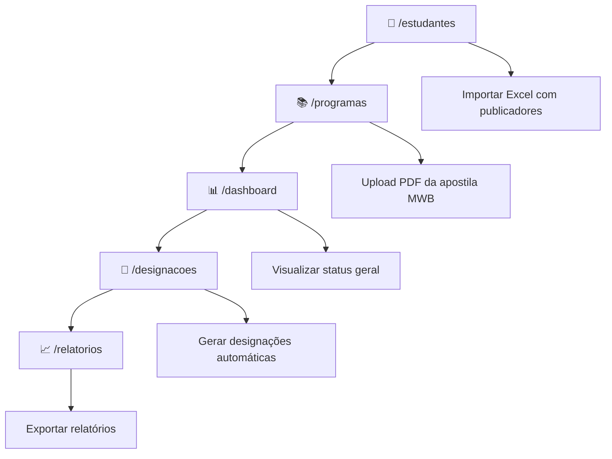

# 📋 WORKFLOW + TASK LIST — Sistema Ministerial

## 🧭 Fluxo de Trabalho do Usuário

### 🎯 Workflow Principal: Instrutor/Coordenador de Vida e Ministério



### 📝 Detalhamento do Fluxo

#### 1. `/estudantes` — Gestão de Publicadores
- **Ação**: Importar planilha `estudantes_ficticios.xlsx` (modelo fornecido)
- **Dados**: Nome, gênero, batizado, pioneiro, ancião, servo ministerial, qualificações
- **Resultado**: Base de dados com todos os estudantes disponíveis
- **Validação**: Sistema verifica campos obrigatórios e formatos

#### 2. `/programas` — Gestão de Programações
- **Ação**: Upload do PDF oficial da apostila MWB (Meeting Workbook)
- **Processamento**: Sistema extrai automaticamente as partes da reunião
- **Armazenamento**: Dados salvos em `programacoes` no Supabase
- **Seleção**: Botão "Usar este programa" define contexto para designações

#### 3. `/dashboard` — Centro de Controle
- **Visualização**: Programação ativa, designações pendentes, métricas gerais
- **Acesso Rápido**: Links diretos para principais funcionalidades
- **Status**: Indicadores visuais do estado atual do sistema

#### 4. `/designacoes` — Motor de Designações S-38
- **Entrada**: Seleção do programa via dropdown
- **Processamento**: 
  - Clique em "Gerar Designações Automáticas"
  - Edge Function `generate-assignments` aplica regras S-38
  - Distribuição equilibrada considerando histórico
- **Saída**: Tabela editável com designações propostas
- **Validação**: Badges visuais indicam conformidade com regras

#### 5. `/relatorios` — Análise e Estatísticas
- **Dados**: Frequência de participação, distribuição de responsabilidades
- **Visualização**: Gráficos e tabelas de desempenho
- **Exportação**: PDF e Excel para arquivo da congregação

---

## ✅ TASK LIST TÉCNICA — September 2025

### 🔥 PRIORIDADE CRÍTICA (Resolver IMEDIATAMENTE)

#### Backend - Edge Functions
- [ ] **Criar `list-programs-json` Edge Function**
  - Path: `/supabase/functions/list-programs-json/index.ts`
  - Objetivo: Retornar programas disponíveis com CORS configurado
  - Status: 🚨 CRÍTICO - resolve erro "Unexpected token '<'"
  - Tempo estimado: 30 minutos

- [ ] **Criar `generate-assignments` Edge Function**
  - Path: `/supabase/functions/generate-assignments/index.ts`
  - Objetivo: Implementar motor de designações S-38
  - Regras: Gênero, cargo, qualificações, distribuição equilibrada
  - Status: 🚨 CRÍTICO - funcionalidade principal
  - Tempo estimado: 2-3 horas

- [ ] **Criar `save-assignments` Edge Function**
  - Path: `/supabase/functions/save-assignments/index.ts`
  - Objetivo: Persistir designações no banco
  - Validação: Verificar regras antes de salvar
  - Status: 🚨 CRÍTICO - completar fluxo
  - Tempo estimado: 1 hora

#### Frontend - Correções CORS
- [ ] **Atualizar `DesignacoesPage.tsx` (linha ~200-300)**
  - Problema: Tentando chamar Edge Functions não existentes
  - Solução: Implementar calls para novas Edge Functions
  - Headers: `Authorization: Bearer ${VITE_SUPABASE_ANON_KEY}`
  - Status: 🚨 CRÍTICO
  - Tempo estimado: 1 hora

- [ ] **Atualizar `ProgramasPage.tsx` (linha ~250-350)**
  - Problema: Calls para endpoints não configurados
  - Solução: Apontar para Edge Functions corretas
  - Status: 🚨 CRÍTICO
  - Tempo estimado: 45 minutos

### ⚡ ALTA PRIORIDADE (Próximos 2-3 dias)

#### Sistema de Autenticação
- [ ] **Implementar tokens reais de autenticação**
  - Problema: Usando 'Bearer test' hardcoded
  - Solução: Integrar com sistema de auth do Supabase
  - Files: Todos os componentes com API calls
  - Status: ⚡ ALTA
  - Tempo estimado: 3-4 horas

#### Otimização de Performance
- [ ] **Reduzir bundle size de 12.47MB para <5MB**
  - Análise: `npm run build -- --analyze`
  - Estratégias: Code splitting, lazy loading, tree shaking
  - Target: <5MB total, <500KB por chunk
  - Status: ⚡ ALTA
  - Tempo estimado: 4-6 horas

- [ ] **Fix ProtectedRoute infinite loops**
  - Problema: Loop infinito no sistema de autenticação
  - Solução: Implementar debounce e otimizar estado
  - Files: `src/components/ProtectedRoute.tsx`
  - Status: ⚡ ALTA
  - Tempo estimado: 2-3 horas

#### Limpeza de Dados
- [ ] **Remover duplicatas em `/programas`**
  - Problema: Múltiplas entradas duplicadas
  - Solução: Script de limpeza + validação no frontend
  - Status: ⚡ ALTA
  - Tempo estimado: 2 horas

- [ ] **Fix botão 'Usar Programa'**
  - Problema: Não está setando contexto global
  - Solução: Implementar state management correto
  - Status: ⚡ ALTA
  - Tempo estimado: 1-2 horas

### 🔧 MÉDIA PRIORIDADE (3-5 dias)

#### Funcionalidades Core
- [ ] **Completar implementação S-38**
  - Regras de gênero: Partes só para irmãos vs. irmãs
  - Qualificações: Ancião, servo ministerial, pioneiro
  - Assistentes: Regras de seleção automática
  - Status: 🔧 MÉDIA
  - Tempo estimado: 6-8 horas

- [ ] **Integração com dados reais**
  - Substituir dados mock por Supabase real
  - Implementar queries otimizadas
  - Cache inteligente para performance
  - Status: 🔧 MÉDIA
  - Tempo estimado: 4-6 horas

- [ ] **Otimizar AG Grid**
  - Reduzir warnings de console
  - Implementar virtualização adequada
  - Performance com grandes datasets
  - Status: 🔧 MÉDIA
  - Tempo estimado: 3-4 horas

#### Schema e Banco
- [ ] **Revisar schema completo**
  - Tables: `estudantes`, `programacoes`, `designacoes`
  - Indices: Otimizar queries principais
  - RLS: Políticas de segurança
  - Status: 🔧 MÉDIA
  - Tempo estimado: 3-4 horas

### 📊 BAIXA PRIORIDADE (Quando tiver tempo)

#### UI/UX Improvements
- [ ] **Implementar Family Graph real**
  - Substituir protótipo por react-flow ou d3
  - Visualização de relacionamentos familiares
  - Status: 📊 BAIXA
  - Tempo estimado: 8-10 horas

- [ ] **Virtualized Students List**
  - Implementar react-window para listas grandes
  - Performance com 1000+ estudantes
  - Status: 📊 BAIXA
  - Tempo estimado: 4-5 horas

#### Infrastructure
- [ ] **Service Worker e PWA**
  - Funcionamento offline
  - Cache inteligente
  - Status: 📊 BAIXA
  - Tempo estimado: 6-8 horas

- [ ] **Real PDF Parsing**
  - Conectar com PDFs oficiais da JW.org
  - Parser automático de apostilas MWB
  - Status: 📊 BAIXA
  - Tempo estimado: 10-12 horas

---

## 🧪 PLANO DE TESTES

### Teste E2E Critical Path
1. **Fluxo Principal**:
   ```
   /estudantes (import Excel) → 
   /programas (upload PDF) → 
   /designacoes (gerar assignments) → 
   /relatorios (export data)
   ```

2. **Validações S-38**:
   - Regras de gênero aplicadas corretamente
   - Distribuição equilibrada de responsabilidades
   - Assistentes selecionados adequadamente

3. **Performance Tests**:
   - Bundle size < 5MB
   - LCP < 800ms
   - Console errors < 10 per page

### Success Criteria
- ✅ Zero erros CORS
- ✅ Designações geradas seguindo S-38
- ✅ Performance within targets
- ✅ Fluxo completo funcional
- ✅ Deploy automático funcionando

---

## 📈 MÉTRICAS DE SUCESSO

| Métrica | Target | Status Atual | Prioridade |
|---------|--------|--------------|------------|
| Bundle Size | <5MB | 12.47MB | 🚨 CRÍTICA |
| LCP | <800ms | 1080ms | ⚡ ALTA |
| Console Errors | <10/page | 50+/page | ⚡ ALTA |
| CORS Errors | 0 | Multiple | 🚨 CRÍTICA |
| S-38 Compliance | 100% | Partial | 🔧 MÉDIA |
| Mobile Responsive | 100% | 80% | 📊 BAIXA |

---

## 🎯 PRÓXIMOS PASSOS IMEDIATOS

1. **[30 min]** Criar Edge Function `list-programs-json`
2. **[2h]** Implementar `generate-assignments` com regras S-38
3. **[1h]** Criar `save-assignments` function
4. **[1h]** Atualizar frontend para usar novas Edge Functions
5. **[30 min]** Deploy e teste do fluxo completo

**Total estimado para resolução crítica: 5 horas**

Após isso, o sistema estará funcional e poderemos focar em otimizações de performance e funcionalidades avançadas.