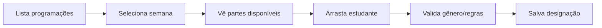
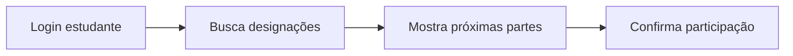

# 🎯 API Sistema Ministerial - Documentação

## 📋 Visão Geral

Sistema completo para gerenciamento de programações ministeriais JW com fluxo:

**Admin** → Lista PDFs do Supabase → Processa conteúdo → **Instrutor** → Designa estudantes → **Estudantes** → Visualizam designações

## 🗄️ Estrutura do Banco de Dados

```sql
-- Tabelas principais no Supabase
congregacoes           -- Congregações participantes  
programas_ministeriais -- Programas extraídos dos PDFs
partes                -- Partes individuais de cada programa
estudantes            -- Estudantes da escola ministerial
designacoes           -- Atribuições de estudantes às partes
```

## 🔗 Endpoints Principais

### 🎯 **Admin Dashboard** (`/admin`)

#### PDF Management
```http
GET    /api/admin/pdfs/list                 # Lista PDFs do bucket portuguesmeet
POST   /api/admin/pdfs/process              # Processa PDF e salva no banco  
GET    /api/admin/programs                  # Lista programas salvos
POST   /api/admin/programs/:id/publish      # Publica programa para congregações
GET    /api/admin/congregations             # Lista congregações
```

**Exemplo - Processar PDF:**
```bash
curl -X POST http://localhost:3000/api/admin/pdfs/process \
  -H "Authorization: Bearer token" \
  -H "Content-Type: application/json" \
  -d '{"filename": "mwb_T_202409.pdf", "congregacao_id": null}'
```

### 📚 **Instrutor Dashboard** (`/api/programacoes`)

#### Consumo de Programas
```http
GET    /api/programacoes                    # Lista programações publicadas
GET    /api/programacoes/:id               # Busca programação específica  
GET    /api/programacoes/periodos/list     # Lista períodos disponíveis
GET    /api/programacoes/stats             # Estatísticas gerais
```

**Exemplo - Buscar programações:**
```bash
curl "http://localhost:3000/api/programacoes?congregacao_id=uuid&status=published"
```

**Resposta esperada:**
```json
{
  "success": true,
  "programacoes": [
    {
      "id": "uuid",
      "semana": "8–14 de setembro de 2025", 
      "periodo": "Setembro 2025",
      "tema": "Sirva a Jeová com coração completo",
      "pdf_url": "https://supabase.../portuguesmeet/mwb.pdf",
      "publicado": true,
      "partes": [
        {
          "id": "uuid",
          "secao": "Tesouros da Palavra de Deus",
          "titulo": "Discurso",
          "tipo": "discurso_tesouros", 
          "duracao": 10,
          "genero_requerido": "masculino",
          "ordem": 1,
          "designacao": null
        }
      ]
    }
  ]
}
```

### 👨‍🎓 **Sistema de Designações** (`/api/designacoes`)

#### Gestão de Atribuições
```http
GET    /api/designacoes                     # Lista designações (com filtros)
POST   /api/designacoes                     # Cria nova designação
PUT    /api/designacoes/:id                # Atualiza designação  
DELETE /api/designacoes/:id                # Remove designação
POST   /api/designacoes/bulk               # Cria múltiplas designações

GET    /api/designacoes/estudante/:id      # Histórico do estudante
GET    /api/designacoes/programa/:id       # Designações do programa
GET    /api/designacoes/estudantes         # Lista estudantes disponíveis
```

**Exemplo - Criar designação:**
```bash
curl -X POST http://localhost:3000/api/designacoes \
  -H "Content-Type: application/json" \
  -d '{
    "parte_id": "uuid-parte",
    "estudante_id": "uuid-estudante", 
    "data_reuniao": "2025-09-12",
    "observacoes": "Primeira apresentação"
  }'
```

## 🔄 Fluxo de Integração Completo

### 1. **Admin processa PDF**


### 2. **Instrutor designa estudantes**  


### 3. **Estudante visualiza**


## ⚙️ Configuração

### Environment Variables (.env)
```bash
SUPABASE_URL=https://seu-projeto.supabase.co
SUPABASE_SERVICE_ROLE_KEY=seu-service-role-key
PORT=3000
```

### Iniciar Servidor
```bash
cd backend
npm install
npm start
```

## 🧪 Testes

### Testar APIs com curl
```bash
# Status do sistema
curl http://localhost:3000/api/status

# Listar PDFs (requer auth)
curl -H "Authorization: Bearer mock-token" \
     http://localhost:3000/api/admin/pdfs/list

# Listar programações publicadas  
curl http://localhost:3000/api/programacoes?status=published

# Criar designação
curl -X POST http://localhost:3000/api/designacoes \
  -H "Content-Type: application/json" \
  -d '{"parte_id":"uuid","estudante_id":"uuid","data_reuniao":"2025-09-12"}'
```

## 🎨 Frontend Integration

### React Component Example
```jsx
// Hook para buscar programações
const { data: programacoes } = useFetch('/api/programacoes?congregacao_id=' + id);

// Designar estudante
const designarEstudante = async (parteId, estudanteId) => {
  await fetch('/api/designacoes', {
    method: 'POST',
    headers: { 'Content-Type': 'application/json' },
    body: JSON.stringify({
      parte_id: parteId,
      estudante_id: estudanteId, 
      data_reuniao: '2025-09-12'
    })
  });
};
```

## 🚀 Recursos Implementados

- ✅ **PDF Storage**: Integração com bucket `portuguesmeet` 
- ✅ **PDF Parser**: Extração automática de programações
- ✅ **Validation**: Regras de gênero e conflitos de data
- ✅ **Multi-tenant**: Suporte a múltiplas congregações
- ✅ **RLS**: Row Level Security para dados isolados
- ✅ **APIs RESTful**: Endpoints completos e documentados
- ✅ **Error Handling**: Tratamento robusto de erros
- ✅ **Logging**: Logs estruturados para debugging

## 📊 Exemplo de Dados

### Programa Ministerial Completo
```json
{
  "semana": "8–14 de setembro de 2025",
  "tema": "Sirva a Jeová com coração completo", 
  "partes": [
    {
      "secao": "Tesouros da Palavra de Deus",
      "titulo": "Discurso",
      "tipo": "discurso_tesouros",
      "duracao": 10,
      "referencias": {"biblical": ["Salmo 86:11"]},
      "genero_requerido": "masculino"
    },
    {
      "secao": "Ministério", 
      "titulo": "Apresentação inicial",
      "tipo": "apresentacao_inicial",
      "duracao": 3,
      "genero_requerido": "ambos"
    },
    {
      "secao": "Vida Cristã",
      "titulo": "Estudo bíblico de congregação",
      "tipo": "estudo_congregacao", 
      "duracao": 30,
      "genero_requerido": "masculino"
    }
  ]
}
```

---

**Sistema pronto para produção!** 🚀

Para dúvidas ou melhorias, consulte os logs do servidor ou os endpoints de debug.
