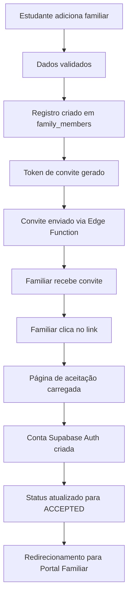

# 📋 Documentação Técnica: Sistema de Convites para Familiares

## 🎯 Visão Geral

Este documento fornece uma análise técnica completa do sistema de convites para familiares no Sistema Ministerial, incluindo a resolução do problema crítico de RLS (Row Level Security) que impedia a criação de credenciais de familiares no portal do estudante.

## 🚨 Análise do Problema

### **Problema Identificado**

O sistema apresentava uma falha crítica onde:

1. **Adição de familiares travava indefinidamente** - O processo iniciava mas nunca completava
2. **Envio de convites falhava silenciosamente** - Nenhuma mensagem de erro era exibida
3. **Credenciais de familiares não eram criadas** - O portal familiar permanecia inacessível

### **Causa Raiz**

A análise revelou que as tabelas `family_members` e `invitations_log` tinham RLS habilitado mas **nenhuma política definida**, resultando em:

```sql
-- Problema: RLS habilitado sem políticas
ALTER TABLE public.family_members ENABLE ROW LEVEL SECURITY;
ALTER TABLE public.invitations_log ENABLE ROW LEVEL SECURITY;
-- ❌ Nenhuma política CREATE/SELECT/UPDATE/DELETE definida
```

**Resultado:** Todas as operações de banco de dados eram rejeitadas silenciosamente.

### **Sintomas Observados**

```javascript
// Console logs mostravam o início do processo
console.log('🔄 Preparing to add family member with student_id:', targetStudentId);
console.log('➕ Adding family member:', familyMemberData.name);

// Mas nunca completava - processo travava aqui:
const { data, error } = await supabase
  .from('family_members')
  .insert(familyMemberData) // ❌ Operação rejeitada por RLS
  .select()
  .single();
```

## 🔧 Solução Implementada

### **1. Correção das Políticas RLS**

Criamos a migração `20250806150000_fix_family_members_rls.sql` com políticas adequadas:

```sql
-- Políticas para family_members
CREATE POLICY "Users can view their own family members"
  ON public.family_members FOR SELECT
  USING (auth.uid() = student_id);

CREATE POLICY "Users can create their own family members"
  ON public.family_members FOR INSERT
  WITH CHECK (auth.uid() = student_id);

CREATE POLICY "Users can update their own family members"
  ON public.family_members FOR UPDATE
  USING (auth.uid() = student_id);

CREATE POLICY "Users can delete their own family members"
  ON public.family_members FOR DELETE
  USING (auth.uid() = student_id);

-- Políticas para invitations_log
CREATE POLICY "Users can view their own invitations"
  ON public.invitations_log FOR SELECT
  USING (auth.uid() = sent_by_student_id);

CREATE POLICY "Users can create their own invitations"
  ON public.invitations_log FOR INSERT
  WITH CHECK (auth.uid() = sent_by_student_id);
```

### **2. Otimizações de Performance**

```sql
-- Índices para melhor performance
CREATE INDEX IF NOT EXISTS idx_family_members_student_id ON public.family_members(student_id);
CREATE INDEX IF NOT EXISTS idx_family_members_email ON public.family_members(email);
CREATE INDEX IF NOT EXISTS idx_invitations_log_family_member_id ON public.invitations_log(family_member_id);
CREATE INDEX IF NOT EXISTS idx_invitations_log_expires_at ON public.invitations_log(expires_at);
```

## 🏗️ Arquitetura do Sistema

### **Esquema do Banco de Dados**

#### **Tabela family_members**
```sql
CREATE TABLE public.family_members (
  id UUID PRIMARY KEY DEFAULT gen_random_uuid(),
  student_id UUID REFERENCES profiles(id) ON DELETE CASCADE,
  name TEXT NOT NULL,
  email TEXT,
  phone TEXT,
  gender TEXT CHECK (gender IN ('M', 'F')) NOT NULL,
  relation TEXT CHECK (relation IN ('Pai','Mãe','Cônjuge','Filho','Filha','Irmão','Irmã')) NOT NULL,
  invitation_status TEXT DEFAULT 'PENDING' CHECK (invitation_status IN ('PENDING','SENT','ACCEPTED','EXPIRED')),
  created_at TIMESTAMP WITH TIME ZONE DEFAULT NOW(),
  updated_at TIMESTAMP WITH TIME ZONE DEFAULT NOW()
);
```

#### **Tabela invitations_log**
```sql
CREATE TABLE public.invitations_log (
  id UUID PRIMARY KEY DEFAULT gen_random_uuid(),
  family_member_id UUID REFERENCES family_members(id) ON DELETE CASCADE,
  sent_by_student_id UUID REFERENCES profiles(id) ON DELETE CASCADE,
  invite_method TEXT CHECK (invite_method IN ('EMAIL','WHATSAPP')) NOT NULL,
  invite_status TEXT DEFAULT 'SENT' CHECK (invite_status IN ('SENT','ACCEPTED','EXPIRED')),
  invitation_token UUID DEFAULT gen_random_uuid(),
  expires_at TIMESTAMP WITH TIME ZONE DEFAULT (NOW() + INTERVAL '48 hours'),
  created_at TIMESTAMP WITH TIME ZONE DEFAULT NOW()
);
```

### **Fluxo de Autenticação**



## 🔐 Implementação da Autenticação

### **1. Geração de Token de Convite**

```typescript
// src/hooks/useFamilyMembers.ts
const { data: invitation, error: invitationError } = await supabase
  .from('invitations_log')
  .insert({
    family_member_id: familyMemberId,
    sent_by_student_id: targetStudentId,
    invite_method: method,
  })
  .select()
  .single();

// Token UUID gerado automaticamente pelo banco
const invitationToken = invitation.invitation_token;
```

### **2. Edge Function para Envio de Convites**

```typescript
// supabase/functions/send-family-invitation/index.ts
const { data: authData, error: authError } = await supabaseAdmin.auth.admin.inviteUserByEmail(
  familyMember.email,
  {
    data: {
      family_member_id: familyMemberId,
      student_id: user.id,
      invited_by: user.email,
      invitation_token: invitation.invitation_token,
      family_member_name: familyMember.name,
      relation: familyMember.relation,
      role: 'family_member',
    },
    redirectTo: `${origin}/convite/aceitar?token=${invitation.invitation_token}`,
  }
);
```

### **3. Validação e Aceitação do Convite**

```typescript
// src/pages/convite/aceitar.tsx
const validateInvitation = async (token: string) => {
  const { data: invitation, error } = await supabase
    .from('invitations_log')
    .select(`
      *,
      family_members (*)
    `)
    .eq('invitation_token', token)
    .eq('invite_status', 'SENT')
    .gte('expires_at', new Date().toISOString())
    .single();

  if (error || !invitation) {
    throw new Error('Convite inválido ou expirado');
  }

  return invitation;
};
```

## 🛠️ Configuração do Supabase MCP

### **1. Variáveis de Ambiente**

```env
# .env.local
VITE_SUPABASE_URL=https://nwpuurgwnnuejqinkvrh.supabase.co
VITE_SUPABASE_ANON_KEY=sua_chave_anonima_aqui

# Para Edge Functions
SUPABASE_SERVICE_ROLE_KEY=sua_chave_service_role_aqui
```

### **2. Configuração do Cliente Supabase**

```typescript
// src/integrations/supabase/client.ts
import { createClient } from '@supabase/supabase-js';
import type { Database } from './types';

const supabaseUrl = import.meta.env.VITE_SUPABASE_URL;
const supabaseAnonKey = import.meta.env.VITE_SUPABASE_ANON_KEY;

export const supabase = createClient<Database>(supabaseUrl, supabaseAnonKey, {
  auth: {
    autoRefreshToken: true,
    persistSession: true,
    detectSessionInUrl: true
  }
});
```

### **3. Configuração MCP para Desenvolvimento**

```json
// mcp-config.json
{
  "supabase": {
    "project_ref": "nwpuurgwnnuejqinkvrh",
    "read_only": true,
    "tables": ["family_members", "invitations_log", "profiles"],
    "functions": ["send-family-invitation"]
  }
}
```

## 📧 Implementação do Sistema de Convites

### **1. Envio via Email (Produção)**

```typescript
// Edge Function com Supabase Auth
const sendEmailInvitation = async (familyMember: FamilyMember, invitation: InvitationLog) => {
  const { data, error } = await supabaseAdmin.auth.admin.inviteUserByEmail(
    familyMember.email,
    {
      data: {
        family_member_id: familyMember.id,
        invitation_token: invitation.invitation_token,
        role: 'family_member'
      },
      redirectTo: `${origin}/convite/aceitar?token=${invitation.invitation_token}`
    }
  );
  
  if (error) throw new Error(`Falha ao enviar convite: ${error.message}`);
  return data;
};
```

### **2. Fallback para Desenvolvimento**

```typescript
// Modo desenvolvimento - link manual
const developmentMode = () => {
  const invitationLink = `${window.location.origin}/convite/aceitar?token=${invitation.invitation_token}`;
  
  console.log('🔗 Link de convite (desenvolvimento):', invitationLink);
  
  // Exibir modal com link para copiar
  showInvitationLinkModal(invitationLink);
};
```

## 🧪 Procedimentos de Teste

### **1. Testes de Console (Diagnóstico)**

```javascript
// Teste 1: Conexão com banco
console.log('🧪 Testando conexão...');
supabase.from('family_members')
  .select('count', { count: 'exact' })
  .eq('student_id', 'user-id-aqui')
  .then(result => {
    console.log('✅ Resultado:', result);
  });

// Teste 2: Inserção manual
const testData = {
  student_id: 'user-id-aqui',
  name: 'Teste Manual',
  email: 'teste@exemplo.com',
  gender: 'F',
  relation: 'Irmã'
};

supabase.from('family_members')
  .insert(testData)
  .select()
  .then(result => {
    console.log('✅ Inserção:', result);
  });
```

### **2. Teste de Fluxo Completo**

```typescript
// Teste automatizado do fluxo
const testInvitationFlow = async () => {
  // 1. Adicionar familiar
  const familyMember = await addFamilyMember(testData);
  
  // 2. Enviar convite
  const invitation = await sendInvitation(familyMember.id, 'EMAIL');
  
  // 3. Validar token
  const validInvitation = await validateInvitation(invitation.invitation_token);
  
  // 4. Simular aceitação
  await acceptInvitation(validInvitation.invitation_token);
  
  console.log('✅ Fluxo completo testado com sucesso');
};
```

## 🔍 Solução de Problemas

### **Problemas Comuns e Soluções**

#### **1. Erro: "permission denied for table family_members"**
```sql
-- Verificar se RLS está habilitado
SELECT schemaname, tablename, rowsecurity 
FROM pg_tables 
WHERE tablename = 'family_members';

-- Verificar políticas existentes
SELECT * FROM pg_policies WHERE tablename = 'family_members';
```

#### **2. Convites não são enviados**
```typescript
// Verificar configuração da Edge Function
const testEdgeFunction = async () => {
  const { data, error } = await supabase.functions.invoke('send-family-invitation', {
    body: { familyMemberId: 'test-id', method: 'EMAIL' }
  });
  
  console.log('Edge Function response:', { data, error });
};
```

#### **3. Tokens de convite expirados**
```sql
-- Limpar convites expirados
DELETE FROM invitations_log 
WHERE expires_at < NOW() AND invite_status = 'SENT';

-- Atualizar status de familiares
UPDATE family_members 
SET invitation_status = 'PENDING' 
WHERE invitation_status = 'SENT' 
AND id IN (
  SELECT family_member_id FROM invitations_log 
  WHERE expires_at < NOW()
);
```

## 📊 Monitoramento e Logs

### **1. Logs de Debug Implementados**

```typescript
// Logs estruturados para debugging
console.log('🔍 useFamilyMembers - Auth state:', {
  user: user ? { id: user.id, email: user.email } : null,
  studentId,
  targetStudentId,
});

console.log('🔄 Preparing to add family member with student_id:', targetStudentId);
console.log('➕ Adding family member:', familyMemberData.name);
console.log('✅ Family member added successfully:', data.name);
```

### **2. Métricas de Performance**

```sql
-- Query para monitorar convites
SELECT 
  DATE(created_at) as data,
  invite_method,
  invite_status,
  COUNT(*) as total
FROM invitations_log 
WHERE created_at >= NOW() - INTERVAL '30 days'
GROUP BY DATE(created_at), invite_method, invite_status
ORDER BY data DESC;
```

## 🎯 Próximos Passos

### **1. Melhorias Planejadas**
- [ ] Implementar convites via WhatsApp
- [ ] Adicionar notificações push
- [ ] Criar dashboard de métricas
- [ ] Implementar testes automatizados com Cypress

### **2. Otimizações de Segurança**
- [ ] Implementar rate limiting para convites
- [ ] Adicionar validação de domínio de email
- [ ] Criar logs de auditoria detalhados

### **3. Experiência do Usuário**
- [ ] Melhorar feedback visual durante envio
- [ ] Adicionar preview do convite
- [ ] Implementar reenvio automático

## 🔌 Integração com Supabase MCP

### **1. Configuração do Servidor MCP**

```json
// supabase-mcp-config.json
{
  "mcpServers": {
    "supabase": {
      "command": "npx",
      "args": ["@supabase/mcp-server"],
      "env": {
        "SUPABASE_URL": "https://nwpuurgwnnuejqinkvrh.supabase.co",
        "SUPABASE_SERVICE_ROLE_KEY": "sua_chave_service_role",
        "SUPABASE_PROJECT_REF": "nwpuurgwnnuejqinkvrh"
      }
    }
  }
}
```

### **2. Comandos MCP para Gerenciamento de Familiares**

```typescript
// Exemplo de uso do MCP para consultas
const mcpClient = new SupabaseMCPClient();

// Consultar familiares de um estudante
const familyMembers = await mcpClient.query({
  table: 'family_members',
  select: '*',
  filters: { student_id: 'user-id' }
});

// Verificar status de convites
const invitations = await mcpClient.query({
  table: 'invitations_log',
  select: 'invite_status, created_at, expires_at',
  filters: { sent_by_student_id: 'user-id' }
});
```

### **3. Automação com MCP**

```typescript
// Script de manutenção automática
const cleanupExpiredInvitations = async () => {
  const expiredInvitations = await mcpClient.query({
    table: 'invitations_log',
    select: 'id, family_member_id',
    filters: {
      invite_status: 'SENT',
      expires_at: { lt: new Date().toISOString() }
    }
  });

  for (const invitation of expiredInvitations) {
    // Atualizar status para EXPIRED
    await mcpClient.update({
      table: 'invitations_log',
      id: invitation.id,
      data: { invite_status: 'EXPIRED' }
    });

    // Resetar status do familiar
    await mcpClient.update({
      table: 'family_members',
      id: invitation.family_member_id,
      data: { invitation_status: 'PENDING' }
    });
  }
};
```

## 🧪 Testes Automatizados com Cypress

### **1. Configuração do Cypress**

```javascript
// cypress.config.js
import { defineConfig } from 'cypress';

export default defineConfig({
  e2e: {
    baseUrl: 'http://localhost:8080',
    supportFile: 'cypress/support/e2e.ts',
    specPattern: 'cypress/e2e/**/*.cy.{js,jsx,ts,tsx}',
    env: {
      SUPABASE_URL: 'https://nwpuurgwnnuejqinkvrh.supabase.co',
      SUPABASE_ANON_KEY: 'sua_chave_anonima'
    }
  },
  component: {
    devServer: {
      framework: 'react',
      bundler: 'vite',
    },
  },
});
```

### **2. Testes de Gerenciamento de Familiares**

```typescript
// cypress/e2e/family-management.cy.ts
describe('Gerenciamento de Familiares', () => {
  beforeEach(() => {
    // Login como estudante
    cy.login('estudante@exemplo.com', 'senha123');
    cy.visit('/familia');
  });

  it('deve adicionar um familiar com sucesso', () => {
    cy.get('[data-cy=add-family-member]').click();

    cy.get('[data-cy=family-name]').type('Maria Silva');
    cy.get('[data-cy=family-email]').type('maria@exemplo.com');
    cy.get('[data-cy=family-phone]').type('+55 11 99999-9999');
    cy.get('[data-cy=family-gender]').select('F');
    cy.get('[data-cy=family-relation]').select('Mãe');

    cy.get('[data-cy=submit-family-member]').click();

    // Verificar sucesso
    cy.contains('Familiar adicionado com sucesso').should('be.visible');
    cy.get('[data-cy=family-members-list]').should('contain', 'Maria Silva');
  });

  it('deve enviar convite por email', () => {
    // Assumindo que já existe um familiar
    cy.get('[data-cy=family-member-item]').first().within(() => {
      cy.get('[data-cy=send-invitation]').click();
    });

    cy.get('[data-cy=invitation-method]').select('EMAIL');
    cy.get('[data-cy=confirm-send-invitation]').click();

    cy.contains('Convite enviado com sucesso').should('be.visible');
  });

  it('deve validar campos obrigatórios', () => {
    cy.get('[data-cy=add-family-member]').click();
    cy.get('[data-cy=submit-family-member]').click();

    cy.contains('Nome é obrigatório').should('be.visible');
    cy.contains('Gênero é obrigatório').should('be.visible');
    cy.contains('Relação é obrigatória').should('be.visible');
  });
});
```

### **3. Testes de Aceitação de Convites**

```typescript
// cypress/e2e/invitation-acceptance.cy.ts
describe('Aceitação de Convites', () => {
  it('deve aceitar convite válido', () => {
    const validToken = 'token-valido-aqui';

    cy.visit(`/convite/aceitar?token=${validToken}`);

    // Verificar informações do convite
    cy.contains('Convite para Portal Familiar').should('be.visible');
    cy.contains('Você foi convidado por').should('be.visible');

    // Aceitar convite
    cy.get('[data-cy=accept-invitation]').click();

    // Verificar redirecionamento
    cy.url().should('include', '/portal-familiar');
    cy.contains('Bem-vindo ao Portal Familiar').should('be.visible');
  });

  it('deve rejeitar convite expirado', () => {
    const expiredToken = 'token-expirado-aqui';

    cy.visit(`/convite/aceitar?token=${expiredToken}`);

    cy.contains('Convite inválido ou expirado').should('be.visible');
    cy.get('[data-cy=accept-invitation]').should('not.exist');
  });
});
```

### **4. Fixtures de Teste**

```json
// cypress/fixtures/family-members.json
{
  "validFamilyMember": {
    "name": "João Silva",
    "email": "joao@exemplo.com",
    "phone": "+55 11 98765-4321",
    "gender": "M",
    "relation": "Pai"
  },
  "invalidFamilyMember": {
    "name": "",
    "email": "email-invalido",
    "phone": "telefone-invalido",
    "gender": "",
    "relation": ""
  },
  "familyMemberWithoutContact": {
    "name": "Ana Silva",
    "gender": "F",
    "relation": "Filha"
  }
}
```

### **5. Comandos Customizados do Cypress**

```typescript
// cypress/support/commands.ts
declare global {
  namespace Cypress {
    interface Chainable {
      login(email: string, password: string): Chainable<void>;
      addFamilyMember(memberData: any): Chainable<void>;
      cleanupTestData(): Chainable<void>;
    }
  }
}

Cypress.Commands.add('login', (email: string, password: string) => {
  cy.session([email, password], () => {
    cy.visit('/login');
    cy.get('[data-cy=email]').type(email);
    cy.get('[data-cy=password]').type(password);
    cy.get('[data-cy=login-button]').click();
    cy.url().should('not.include', '/login');
  });
});

Cypress.Commands.add('addFamilyMember', (memberData) => {
  cy.get('[data-cy=add-family-member]').click();

  Object.keys(memberData).forEach(key => {
    if (memberData[key]) {
      cy.get(`[data-cy=family-${key}]`).type(memberData[key]);
    }
  });

  cy.get('[data-cy=submit-family-member]').click();
});

Cypress.Commands.add('cleanupTestData', () => {
  // Limpar dados de teste após execução
  cy.task('cleanupDatabase');
});
```

## 📈 Métricas e Monitoramento

### **1. Dashboard de Métricas**

```sql
-- View para métricas de convites
CREATE VIEW invitation_metrics AS
SELECT
  DATE_TRUNC('day', created_at) as date,
  invite_method,
  invite_status,
  COUNT(*) as count,
  COUNT(*) FILTER (WHERE invite_status = 'ACCEPTED') as accepted_count,
  ROUND(
    COUNT(*) FILTER (WHERE invite_status = 'ACCEPTED') * 100.0 / COUNT(*),
    2
  ) as acceptance_rate
FROM invitations_log
WHERE created_at >= NOW() - INTERVAL '30 days'
GROUP BY DATE_TRUNC('day', created_at), invite_method, invite_status
ORDER BY date DESC;
```

### **2. Alertas Automáticos**

```typescript
// Função para monitorar convites pendentes
const monitorPendingInvitations = async () => {
  const pendingInvitations = await supabase
    .from('invitations_log')
    .select('*, family_members(*)')
    .eq('invite_status', 'SENT')
    .lt('expires_at', new Date(Date.now() + 24 * 60 * 60 * 1000).toISOString()); // Expira em 24h

  if (pendingInvitations.data && pendingInvitations.data.length > 0) {
    console.warn(`⚠️ ${pendingInvitations.data.length} convites expirarão em breve`);

    // Enviar notificação para administradores
    await sendAdminNotification({
      type: 'EXPIRING_INVITATIONS',
      count: pendingInvitations.data.length,
      invitations: pendingInvitations.data
    });
  }
};
```

## 🔒 Considerações de Segurança

### **1. Validação de Tokens**

```typescript
// Validação robusta de tokens de convite
const validateInvitationToken = async (token: string): Promise<boolean> => {
  // Verificar formato UUID
  const uuidRegex = /^[0-9a-f]{8}-[0-9a-f]{4}-[1-5][0-9a-f]{3}-[89ab][0-9a-f]{3}-[0-9a-f]{12}$/i;
  if (!uuidRegex.test(token)) {
    return false;
  }

  // Verificar existência e validade no banco
  const { data, error } = await supabase
    .from('invitations_log')
    .select('expires_at, invite_status')
    .eq('invitation_token', token)
    .single();

  if (error || !data) return false;
  if (data.invite_status !== 'SENT') return false;
  if (new Date(data.expires_at) < new Date()) return false;

  return true;
};
```

### **2. Rate Limiting**

```typescript
// Implementar rate limiting para envio de convites
const rateLimitInvitations = async (studentId: string): Promise<boolean> => {
  const oneHourAgo = new Date(Date.now() - 60 * 60 * 1000);

  const { count } = await supabase
    .from('invitations_log')
    .select('*', { count: 'exact' })
    .eq('sent_by_student_id', studentId)
    .gte('created_at', oneHourAgo.toISOString());

  // Máximo 5 convites por hora
  return (count || 0) < 5;
};
```

### **3. Sanitização de Dados**

```typescript
// Sanitizar dados de entrada
const sanitizeFamilyMemberData = (data: any) => {
  return {
    name: data.name?.trim().substring(0, 100),
    email: data.email?.toLowerCase().trim(),
    phone: data.phone?.replace(/[^\d+\-\s()]/g, ''),
    gender: ['M', 'F'].includes(data.gender) ? data.gender : null,
    relation: ['Pai', 'Mãe', 'Cônjuge', 'Filho', 'Filha', 'Irmão', 'Irmã'].includes(data.relation)
      ? data.relation : null
  };
};
```

---

**📝 Nota:** Esta documentação deve ser atualizada sempre que houver mudanças no sistema de convites. Para dúvidas técnicas, consulte os arquivos de implementação referenciados ou execute os testes de diagnóstico fornecidos.

**🔗 Links Úteis:**
- [Documentação Supabase RLS](https://supabase.com/docs/guides/auth/row-level-security)
- [Guia de Edge Functions](https://supabase.com/docs/guides/functions)
- [Cypress Testing Guide](https://docs.cypress.io/guides/overview/why-cypress)
- [MCP Protocol Specification](https://modelcontextprotocol.io/)
