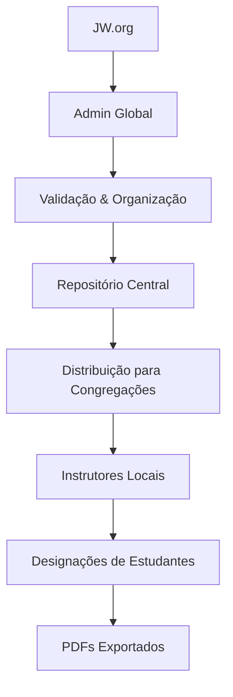

# 🎯 Guia do Administrador - Sistema Ministerial Global

## 👥 **PERFIS DE USUÁRIO E HIERARQUIA**

### **1. Administrador Global (Nível Sistema)**
- **Função**: Gerencia programações oficiais para todas as congregações
- **Dashboard**: Próprio e exclusivo, diferente dos instrutores
- **Acesso**: Apenas dados de programação, nunca dados pessoais de estudantes
- **Responsabilidades**: Download, validação e distribuição de materiais JW.org

### **2. Instrutor de Congregação (Nível Local)**
- **Função**: Recebe programações e designa estudantes seguindo regras S-38
- **Dashboard**: Local, específico da congregação
- **Acesso**: Apenas sua congregação
- **Modo**: Offline-first com sincronização opcional

### **3. Estudante (Nível Individual)**
- **Função**: Consulta suas designações
- **Acesso**: Apenas suas próprias designações
- **Interface**: App local ou portal web

---

## 🏗️ **ARQUITETURA DO SISTEMA**

### **Fluxo de Dados:**


### **Estrutura de Pastas:**
```
📁 docs/Oficial/
├── 📅 2025-07/
│   ├── 📄 mwb_E_202507.pdf
│   ├── 🎵 mwb_T_202507.daisy.zip
│   └── 📋 manifest.json
├── 📅 2025-09/
│   ├── 📄 mwb_E_202509.pdf
│   ├── 🎵 mwb_T_202509.daisy.zip
│   └── 📋 manifest.json
└── 📋 global-manifest.json
```

---

## 🔧 **DASHBOARD DO ADMINISTRADOR GLOBAL**

### **Seções Principais:**

#### **1. 📥 Gestão de Downloads**
- **Status de Downloads**: Últimas apostilas baixadas
- **Botão "Baixar Agora"**: Força atualização manual
- **Log de Downloads**: Histórico de todas as operações
- **Verificação de Integridade**: Checksum dos arquivos

#### **2. 📚 Organização de Materiais**
- **Validação Automática**: Verifica se arquivos estão completos
- **Categorização**: Organiza por idioma, período e tipo
- **Metadados**: Extrai informações dos PDFs e DAISY
- **Status de Qualidade**: OK, Corrompido, Incompleto

#### **3. 🌐 Publicação para Congregações**
- **Seleção de Períodos**: Escolhe quais meses liberar
- **Geração de Pacotes**: Cria .zip com materiais + manifest
- **Chaves de Atualização**: Gera tokens para sincronização
- **Controle de Versões**: Gerencia diferentes releases

#### **4. 📊 Monitoramento e Estatísticas**
- **Congregações Ativas**: Quantas estão usando o sistema
- **Downloads por Período**: Estatísticas de uso
- **Status de Sincronização**: Quais congregações estão atualizadas
- **Relatórios de Uso**: Métricas de engajamento

---

## 🚀 **FLUXO DE TRABALHO DO ADMINISTRADOR**

### **Processo Semanal/Mensal:**

#### **1. Verificação de Novos Materiais**
```bash
# Dashboard mostra:
✅ Última verificação: 2025-08-15 10:30
🆕 Novos materiais disponíveis: 2
📅 Próximo período: 2025-11
```

#### **2. Download Automático**
- Sistema baixa automaticamente do JW.org
- Valida integridade dos arquivos
- Organiza na estrutura de pastas
- Atualiza manifest.json

#### **3. Validação e Organização**
- Verifica se todos os arquivos estão completos
- Extrai metadados (títulos, durações, tipos de parte)
- Mapeia para regras S-38
- Gera índice de conteúdo

#### **4. Publicação**
- Seleciona períodos para liberar
- Gera pacotes de distribuição
- Cria chaves de atualização
- Notifica congregações (opcional)

---

## 📋 **CHECKLIST DE OPERAÇÕES**

### **Diário:**
- [ ] Verificar dashboard por novas notificações
- [ ] Monitorar status de downloads automáticos
- [ ] Verificar integridade de arquivos baixados

### **Semanal:**
- [ ] Revisar materiais da semana
- [ ] Validar organização de pastas
- [ ] Verificar status de sincronização das congregações

### **Mensal:**
- [ ] Baixar novas apostilas do JW.org
- [ ] Organizar materiais por período
- [ ] Publicar pacotes para congregações
- [ ] Atualizar manifest global

---

## 🔒 **SEGURANÇA E LIMITES**

### **Princípios de Segurança:**
1. **Separação de Dados**: Admin nunca vê dados pessoais de estudantes
2. **Acesso por Nível**: Cada usuário só acessa seu nível hierárquico
3. **Auditoria Completa**: Todas as ações são registradas
4. **Validação de Arquivos**: Downloads sempre verificados com checksum

### **Limites do Administrador:**
- ❌ **NÃO pode** ver dados de estudantes individuais
- ❌ **NÃO pode** alterar designações de congregações
- ❌ **NÃO pode** acessar dados pessoais de usuários
- ✅ **PODE** gerenciar programações oficiais
- ✅ **PODE** monitorar uso do sistema
- ✅ **PODE** distribuir materiais para congregações

---

## 📱 **INTERFACE DO DASHBOARD**

### **Layout Responsivo:**
- **Desktop**: Visão completa com todas as seções
- **Tablet**: Layout adaptado para gestão móvel
- **Mobile**: Foco em operações essenciais

### **Componentes Principais:**
1. **Header**: Status do sistema, notificações, usuário logado
2. **Sidebar**: Navegação entre seções
3. **Main Content**: Área de trabalho principal
4. **Footer**: Informações do sistema e versão

---

## 🔄 **SINCRONIZAÇÃO COM CONGREGAÇÕES**

### **Método de Distribuição:**
1. **Pacotes ZIP**: Contêm materiais + manifest + instruções
2. **Chaves de Atualização**: Tokens únicos para cada congregação
3. **Download Direto**: Instrutores baixam do sistema central
4. **Verificação Local**: App local valida integridade dos arquivos

### **Controle de Versões:**
- **Versionamento**: Cada release tem número único
- **Rollback**: Possibilidade de voltar para versão anterior
- **Compatibilidade**: Verifica se app local suporta nova versão
- **Notificações**: Alerta congregações sobre atualizações

---

## 📈 **MÉTRICAS E RELATÓRIOS**

### **Dashboard Analytics:**
- **Uso do Sistema**: Congregações ativas, downloads, sincronizações
- **Performance**: Tempo de resposta, disponibilidade
- **Qualidade**: Taxa de sucesso de downloads, erros reportados
- **Engajamento**: Frequência de uso, materiais mais acessados

### **Relatórios Exportáveis:**
- **PDF**: Relatórios mensais/trimestrais
- **Excel**: Dados para análise externa
- **JSON**: API para integrações
- **CSV**: Dados para importação em outros sistemas

---

## 🚨 **RESOLUÇÃO DE PROBLEMAS**

### **Problemas Comuns:**

#### **1. Download Falhou**
- Verificar conectividade com JW.org
- Tentar download manual
- Verificar espaço em disco
- Consultar logs de erro

#### **2. Arquivo Corrompido**
- Re-download do arquivo
- Verificar checksum
- Comparar com backup
- Reportar para suporte

#### **3. Sincronização Falhou**
- Verificar status da congregação
- Reenviar pacote de atualização
- Verificar compatibilidade de versão
- Contatar instrutor local

---

## 📚 **RECURSOS E REFERÊNCIAS**

### **Documentação Técnica:**
- [Regras S-38 Oficiais](docs/Oficial/S-38_E.rtf)
- [Estrutura de Banco](docs/PLANO_IMPLEMENTACAO_HISTORICO_FILA_JUSTA.md)
- [API de Integração](docs/API_INTEGRATION.md)

### **Contatos de Suporte:**
- **Desenvolvimento**: Equipe técnica do sistema
- **JW.org**: Suporte oficial para materiais
- **Comunidade**: Fórum de instrutores

---

## ✅ **STATUS DE IMPLEMENTAÇÃO**

### **🎉 COMPLETADO:**
- ✅ Estrutura de banco de dados
- ✅ Sistema de equidade com regras S-38
- ✅ Interface para instrutores
- ✅ Documentação técnica

### **🚧 EM DESENVOLVIMENTO:**
- 🔄 Dashboard do administrador global
- 🔄 Sistema de download automático
- 🔄 Gestão de materiais MWB
- 🔄 Distribuição para congregações

---

**Este guia será atualizado conforme o sistema evolui. Para dúvidas técnicas, consulte a documentação de desenvolvimento.**
