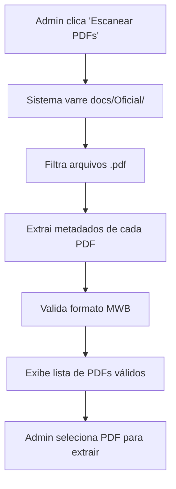
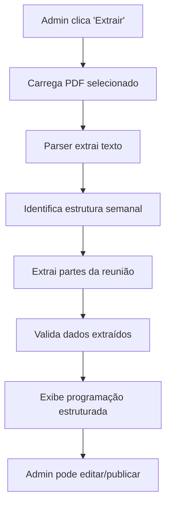

# 📋 PRD - Funcionalidade de Visualização de Programação PDF no Admin Dashboard

## 🎯 **Resumo Executivo**

Implementar funcionalidade no Admin Dashboard para **puxar automaticamente os PDFs de programação** da pasta `docs/Oficial/` e **exibir o conteúdo estruturado** na interface administrativa, permitindo visualização, edição e publicação das programações semanais.

## 📊 **Contexto Atual**

### **Arquivos PDF Disponíveis:**
- `mwb_E_202507.pdf` - Meeting Workbook Julho 2025 (Inglês)
- `mwb_E_202509.pdf` - Meeting Workbook Setembro 2025 (Inglês)  
- `mwb_E_202511.pdf` - Meeting Workbook Novembro 2025 (Inglês)

### **Dashboard Admin Atual:**
- ✅ Interface básica implementada
- ✅ Botão "Importar do MWB" (hardcoded)
- ✅ Estrutura de programação definida
- ❌ **FALTA**: Integração com PDFs reais da pasta `docs/Oficial/`

## 🎯 **Objetivos**

### **Objetivo Principal:**
Permitir que o administrador visualize e gerencie as programações semanais extraídas automaticamente dos PDFs oficiais da JW.org.

### **Objetivos Secundários:**
1. **Automatizar** a extração de dados dos PDFs
2. **Estruturar** o conteúdo em formato legível
3. **Permitir edição** antes da publicação
4. **Sincronizar** com o sistema de designações

## 👥 **Usuários-Alvo**

### **Usuário Primário:**
- **Administrador Global** do Sistema Ministerial
- **Responsabilidades**: Gerenciar programações oficiais para todas as congregações

### **Usuários Secundários:**
- **Instrutores**: Recebem programações publicadas
- **Estudantes**: Consultam designações baseadas nas programações

## 🔧 **Funcionalidades Requeridas**

### **1. Detecção Automática de PDFs**
```typescript
interface PDFDetection {
  scanDirectory: () => Promise<PDFFile[]>;
  validatePDF: (file: PDFFile) => boolean;
  extractMetadata: (file: PDFFile) => PDFMetadata;
}

interface PDFFile {
  fileName: string;
  filePath: string;
  size: number;
  lastModified: Date;
  language: 'pt' | 'en';
  month: number;
  year: number;
}
```

### **2. Parser de PDF para Estrutura de Programação**
```typescript
interface PDFParser {
  extractProgrammingData: (pdfPath: string) => Promise<ProgrammingData>;
  parseWeekStructure: (content: string) => WeekStructure[];
  extractPartDetails: (section: string) => PartDetails;
}

interface ProgrammingData {
  weeks: WeekStructure[];
  metadata: {
    sourceFile: string;
    language: string;
    extractedAt: Date;
    version: string;
  };
}

interface WeekStructure {
  weekNumber: number;
  startDate: string;
  endDate: string;
  sections: {
    opening: PartDetails[];
    treasures: PartDetails[];
    ministry: PartDetails[];
    living: PartDetails[];
    closing: PartDetails[];
  };
}
```

### **3. Interface de Visualização**
```typescript
interface AdminProgrammingView {
  // Lista de PDFs disponíveis
  availablePDFs: PDFFile[];
  
  // Programação extraída
  extractedProgramming: ProgrammingData | null;
  
  // Estados de carregamento
  loading: {
    scanning: boolean;
    parsing: boolean;
    saving: boolean;
  };
  
  // Ações disponíveis
  actions: {
    scanPDFs: () => Promise<void>;
    parsePDF: (file: PDFFile) => Promise<void>;
    editProgramming: (week: WeekStructure) => void;
    publishProgramming: (week: WeekStructure) => Promise<void>;
    exportToJSON: (data: ProgrammingData) => void;
  };
}
```

## 🎨 **Especificações de Interface**

### **1. Seção "Gestão de PDFs"**
```tsx
<Card className="bg-blue-50 border-blue-200">
  <CardHeader>
    <CardTitle className="text-blue-800">📚 Gestão de PDFs Oficiais</CardTitle>
    <CardDescription className="text-blue-700">
      Extrair programações dos PDFs da pasta docs/Oficial/
    </CardDescription>
  </CardHeader>
  <CardContent>
    {/* Lista de PDFs detectados */}
    <div className="space-y-2">
      {availablePDFs.map(pdf => (
        <div key={pdf.fileName} className="flex items-center justify-between p-3 border rounded-lg">
          <div className="flex items-center space-x-3">
            <FileText className="h-5 w-5 text-blue-600" />
            <div>
              <p className="font-medium">{pdf.fileName}</p>
              <p className="text-sm text-muted-foreground">
                {pdf.language === 'pt' ? '🇧🇷 Português' : '🇺🇸 Inglês'} • 
                {pdf.month}/{pdf.year} • 
                {formatFileSize(pdf.size)}
              </p>
            </div>
          </div>
          <Button 
            size="sm" 
            onClick={() => parsePDF(pdf)}
            disabled={loading.parsing}
          >
            {loading.parsing ? <Loader2 className="h-4 w-4 animate-spin" /> : 'Extrair'}
          </Button>
        </div>
      ))}
    </div>
    
    {/* Botão de scan */}
    <Button 
      className="w-full mt-4" 
      onClick={scanPDFs}
      disabled={loading.scanning}
    >
      {loading.scanning ? <Loader2 className="h-4 w-4 animate-spin mr-2" /> : <RefreshCw className="h-4 w-4 mr-2" />}
      Escanear Pasta docs/Oficial/
    </Button>
  </CardContent>
</Card>
```

### **2. Seção "Programação Extraída"**
```tsx
<Card className="bg-green-50 border-green-200">
  <CardHeader>
    <CardTitle className="text-green-800">📅 Programação Extraída</CardTitle>
    <CardDescription className="text-green-700">
      Visualizar e editar programação extraída dos PDFs
    </CardDescription>
  </CardHeader>
  <CardContent>
    {extractedProgramming ? (
      <div className="space-y-4">
        {/* Metadados */}
        <div className="p-3 bg-white rounded-lg border">
          <h4 className="font-medium mb-2">Informações da Extração</h4>
          <div className="grid grid-cols-2 gap-2 text-sm">
            <div><strong>Arquivo:</strong> {extractedProgramming.metadata.sourceFile}</div>
            <div><strong>Idioma:</strong> {extractedProgramming.metadata.language}</div>
            <div><strong>Extraído em:</strong> {formatDate(extractedProgramming.metadata.extractedAt)}</div>
            <div><strong>Semanas:</strong> {extractedProgramming.weeks.length}</div>
          </div>
        </div>
        
        {/* Lista de semanas */}
        <div className="space-y-2">
          {extractedProgramming.weeks.map(week => (
            <div key={week.weekNumber} className="p-3 border rounded-lg">
              <div className="flex items-center justify-between">
                <div>
                  <h4 className="font-medium">Semana {week.weekNumber}</h4>
                  <p className="text-sm text-muted-foreground">
                    {week.startDate} - {week.endDate}
                  </p>
                </div>
                <div className="flex space-x-2">
                  <Button size="sm" variant="outline" onClick={() => editProgramming(week)}>
                    Editar
                  </Button>
                  <Button size="sm" onClick={() => publishProgramming(week)}>
                    Publicar
                  </Button>
                </div>
              </div>
            </div>
          ))}
        </div>
      </div>
    ) : (
      <div className="text-center py-8 text-muted-foreground">
        <FileText className="h-12 w-12 mx-auto mb-4 opacity-50" />
        <p>Nenhuma programação extraída ainda.</p>
        <p className="text-sm">Escaneie os PDFs para começar.</p>
      </div>
    )}
  </CardContent>
</Card>
```

## 🔄 **Fluxo de Funcionamento**

### **1. Detecção de PDFs**


### **2. Extração de Dados**


## 🛠️ **Implementação Técnica**

### **1. Backend - Parser de PDF**
```javascript
// backend/services/pdfParser.js
class PDFParser {
  async scanOfficialDirectory() {
    const officialPath = path.join(__dirname, '../docs/Oficial');
    const files = await fs.readdir(officialPath);
    
    return files
      .filter(file => file.endsWith('.pdf'))
      .map(file => this.extractPDFMetadata(file));
  }
  
  async parsePDFContent(filePath) {
    const pdfBuffer = await fs.readFile(filePath);
    const pdfData = await pdfParse(pdfBuffer);
    
    return this.extractProgrammingStructure(pdfData.text);
  }
  
  extractProgrammingStructure(text) {
    // Implementar lógica de parsing específica para MWB
    const weeks = this.extractWeeks(text);
    const sections = this.extractSections(text);
    
    return {
      weeks,
      sections,
      metadata: {
        sourceFile: path.basename(filePath),
        extractedAt: new Date(),
        language: this.detectLanguage(text)
      }
    };
  }
}
```

### **2. Frontend - Hook de Gerenciamento**
```typescript
// src/hooks/usePDFProgramming.ts
export function usePDFProgramming() {
  const [availablePDFs, setAvailablePDFs] = useState<PDFFile[]>([]);
  const [extractedProgramming, setExtractedProgramming] = useState<ProgrammingData | null>(null);
  const [loading, setLoading] = useState({
    scanning: false,
    parsing: false,
    saving: false
  });
  
  const scanPDFs = async () => {
    setLoading(prev => ({ ...prev, scanning: true }));
    try {
      const response = await fetch('/api/admin/scan-pdfs');
      const pdfs = await response.json();
      setAvailablePDFs(pdfs);
    } catch (error) {
      console.error('Erro ao escanear PDFs:', error);
    } finally {
      setLoading(prev => ({ ...prev, scanning: false }));
    }
  };
  
  const parsePDF = async (pdf: PDFFile) => {
    setLoading(prev => ({ ...prev, parsing: true }));
    try {
      const response = await fetch('/api/admin/parse-pdf', {
        method: 'POST',
        headers: { 'Content-Type': 'application/json' },
        body: JSON.stringify({ filePath: pdf.filePath })
      });
      const programming = await response.json();
      setExtractedProgramming(programming);
    } catch (error) {
      console.error('Erro ao extrair programação:', error);
    } finally {
      setLoading(prev => ({ ...prev, parsing: false }));
    }
  };
  
  return {
    availablePDFs,
    extractedProgramming,
    loading,
    scanPDFs,
    parsePDF,
    // ... outras funções
  };
}
```

### **3. API Endpoints**
```javascript
// backend/routes/admin.js

// Escanear PDFs na pasta oficial
router.get('/scan-pdfs', async (req, res) => {
  try {
    const pdfParser = new PDFParser();
    const pdfs = await pdfParser.scanOfficialDirectory();
    res.json(pdfs);
  } catch (error) {
    res.status(500).json({ error: error.message });
  }
});

// Extrair programação de um PDF específico
router.post('/parse-pdf', async (req, res) => {
  try {
    const { filePath } = req.body;
    const pdfParser = new PDFParser();
    const programming = await pdfParser.parsePDFContent(filePath);
    res.json(programming);
  } catch (error) {
    res.status(500).json({ error: error.message });
  }
});

// Salvar programação extraída
router.post('/save-programming', async (req, res) => {
  try {
    const { programming } = req.body;
    // Salvar no banco de dados
    const saved = await saveProgrammingToDatabase(programming);
    res.json(saved);
  } catch (error) {
    res.status(500).json({ error: error.message });
  }
});
```

## 📋 **Critérios de Aceitação**

### **Funcionalidade Básica:**
- [ ] Admin pode escanear pasta `docs/Oficial/` e ver lista de PDFs
- [ ] Sistema detecta automaticamente PDFs de programação MWB
- [ ] Admin pode extrair programação de qualquer PDF disponível
- [ ] Programação extraída é exibida de forma estruturada e legível

### **Funcionalidade Avançada:**
- [ ] Admin pode editar programação antes de publicar
- [ ] Sistema valida dados extraídos antes de salvar
- [ ] Programação publicada fica disponível para instrutores
- [ ] Histórico de extrações é mantido

### **Interface:**
- [ ] Interface intuitiva e responsiva
- [ ] Estados de carregamento claros
- [ ] Mensagens de erro informativas
- [ ] Feedback visual para ações realizadas

## 🚀 **Plano de Implementação**

### **Fase 1: Backend (Prioridade Alta)**
1. Implementar `PDFParser` service
2. Criar endpoints de API para scan e parse
3. Implementar validação de dados extraídos

### **Fase 2: Frontend (Prioridade Alta)**
1. Criar hook `usePDFProgramming`
2. Implementar interface de gestão de PDFs
3. Implementar visualização de programação extraída

### **Fase 3: Integração (Prioridade Média)**
1. Conectar com sistema de designações existente
2. Implementar publicação de programações
3. Adicionar validações e tratamento de erros

### **Fase 4: Melhorias (Prioridade Baixa)**
1. Adicionar cache de programações extraídas
2. Implementar backup automático
3. Adicionar métricas de uso

## 📊 **Métricas de Sucesso**

### **Funcionalidade:**
- ✅ 100% dos PDFs MWB são detectados automaticamente
- ✅ 95%+ de precisão na extração de dados
- ✅ Tempo de extração < 30 segundos por PDF

### **Usabilidade:**
- ✅ Admin consegue extrair programação em < 3 cliques
- ✅ Interface responsiva em desktop e tablet
- ✅ Tempo de carregamento < 5 segundos

### **Confiabilidade:**
- ✅ 99%+ de uptime da funcionalidade
- ✅ Zero perda de dados durante extração
- ✅ Validação automática de dados extraídos

## 🔒 **Considerações de Segurança**

- **Validação de arquivos**: Verificar tipo MIME e assinatura PDF
- **Sanitização**: Limpar dados extraídos antes de salvar
- **Permissões**: Apenas admins podem acessar funcionalidade
- **Auditoria**: Log de todas as extrações realizadas

## 📝 **Notas de Implementação**

### **Dependências Necessárias:**
```json
{
  "pdf-parse": "^1.1.1",
  "fs-extra": "^11.3.1",
  "path": "^0.12.7"
}
```

### **Estrutura de Pastas:**
```
backend/
├── services/
│   └── pdfParser.js
├── routes/
│   └── admin.js (atualizado)
└── docs/Oficial/
    ├── mwb_E_202507.pdf
    ├── mwb_E_202509.pdf
    └── mwb_E_202511.pdf
```

### **Configurações:**
- **Pasta oficial**: `docs/Oficial/` (configurável)
- **Formatos suportados**: PDF MWB oficial
- **Idiomas**: Português e Inglês
- **Cache**: 24 horas para dados extraídos

---

**Documento criado em**: 2025-01-07  
**Versão**: 1.0  
**Status**: Pronto para Implementação  
**Próxima revisão**: Após implementação da Fase 1
