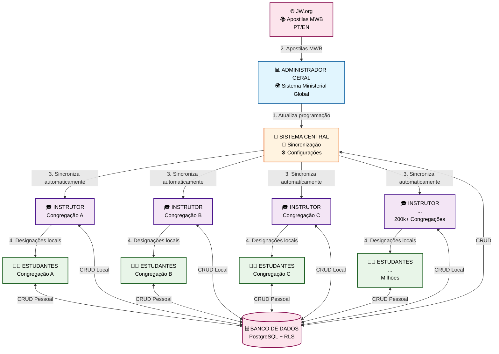
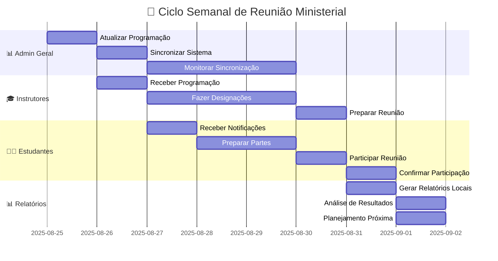
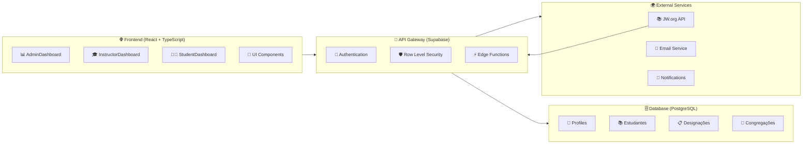
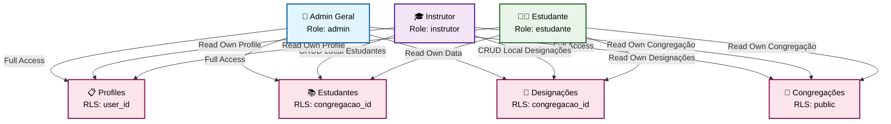
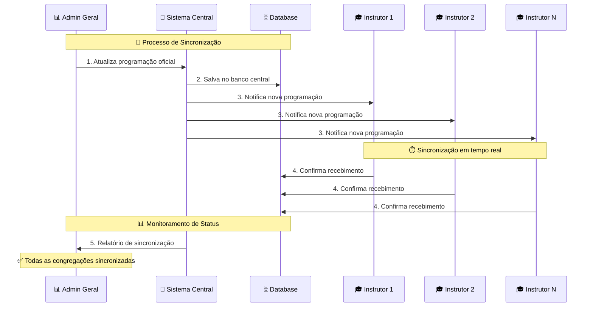
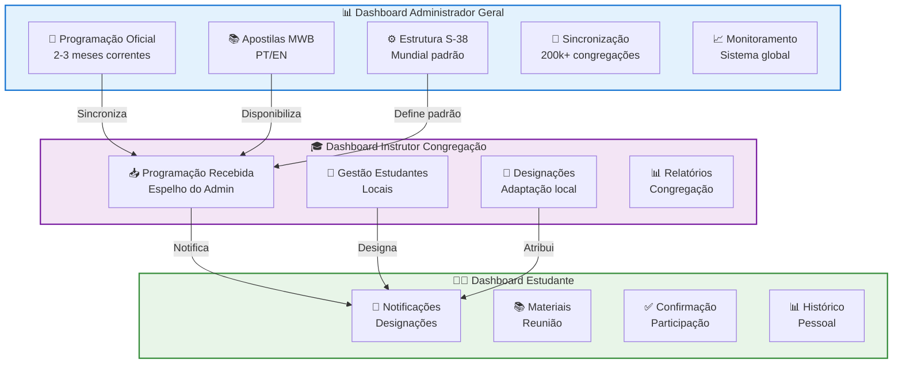
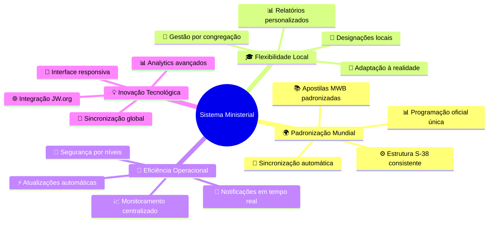

# 🎨 System Flow Diagram - Sistema Ministerial

## 📊 Diagrama de Fluxo Principal

## 🔄 Ciclo Semanal de Reunião

## 🏗️ Arquitetura do Sistema

## 🔐 Sistema de Permissões e RLS

## 📊 Fluxo de Sincronização

## 🎯 Dashboard Flow

## 🌟 Benefícios e Resultados

---

## 📋 Como Usar Estes Diagramas

### 🔧 **Para Desenvolvedores:**
1. **Implementação:** Use os diagramas como referência para arquitetura
2. **Fluxo de Dados:** Entenda como as informações fluem entre níveis
3. **Permissões:** Implemente RLS baseado no diagrama de segurança
4. **Sincronização:** Siga o padrão de comunicação estabelecido

### 🎯 **Para Stakeholders:**
1. **Visão Geral:** Entenda o fluxo completo do sistema
2. **Responsabilidades:** Veja claramente quem faz o quê
3. **Benefícios:** Compreenda os resultados esperados
4. **Timeline:** Acompanhe o ciclo semanal de trabalho

### 📊 **Para Testes:**
1. **Cenários:** Use os fluxos para criar casos de teste
2. **Integração:** Teste a sincronização entre níveis
3. **Permissões:** Valide o isolamento de dados por RLS
4. **Performance:** Monitore a sincronização em tempo real

---

*Estes diagramas são atualizados conforme o sistema evolui e novas funcionalidades são implementadas.*
