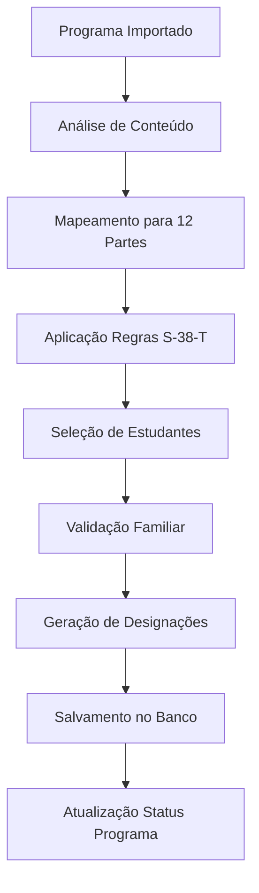
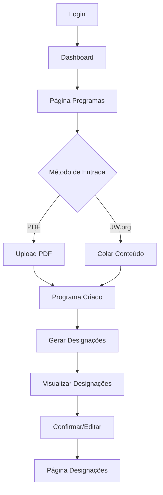

# Sistema Ministerial - Documentação Técnica da Lógica do Sistema

## Índice
1. [Visão Geral do Sistema](#1-visão-geral-do-sistema)
2. [Lógica de Geração de Designações](#2-lógica-de-geração-de-designações)
3. [Arquitetura do Banco de Dados](#3-arquitetura-do-banco-de-dados)
4. [Sistema de Análise de Conteúdo](#4-sistema-de-análise-de-conteúdo)
5. [Regras de Conformidade S-38-T](#5-regras-de-conformidade-s-38-t)
6. [Fluxo da Interface do Usuário](#6-fluxo-da-interface-do-usuário)

---

## 1. Visão Geral do Sistema

### 1.1 Propósito
O Sistema Ministerial é uma aplicação web desenvolvida para congregações das Testemunhas de Jeová no Brasil, com o objetivo de automatizar e otimizar o processo de geração de designações para as reuniões semanais. O sistema segue rigorosamente as diretrizes estabelecidas no documento S-38-T da organização.

### 1.2 Funcionalidades Principais
- **Geração Automática de Designações**: Criação inteligente de 12 designações por programa de reunião
- **Conformidade S-38-T**: Aplicação automática das regras de qualificação e restrições de gênero
- **Análise de Conteúdo**: Processamento de conteúdo do JW.org e arquivos PDF
- **Gestão de Estudantes**: Controle de qualificações, disponibilidade e relacionamentos familiares
- **Interface Intuitiva**: Experiência de usuário otimizada para instrutores da Escola do Ministério Teocrático

### 1.3 Arquitetura Técnica
```
Frontend (React/TypeScript) ↔ Supabase (PostgreSQL + Auth) ↔ Regras S-38-T
                ↓
    Sistema de Geração de Designações
                ↓
    Estrutura Completa da Reunião (12 partes)
```

---

## 2. Lógica de Geração de Designações

### 2.1 Evolução da Estrutura da Reunião

#### Sistema Anterior (5 partes - 3 a 7):
```typescript
const estruturaAnterior = [
  { numero: 3, tipo: 'leitura_biblica', titulo: 'Leitura da Bíblia' },
  { numero: 4, tipo: 'demonstracao', titulo: 'Primeira Conversa' },
  { numero: 5, tipo: 'demonstracao', titulo: 'Revisita' },
  { numero: 6, tipo: 'demonstracao', titulo: 'Estudo Bíblico' },
  { numero: 7, tipo: 'discurso', titulo: 'Discurso' }
];
```

#### Sistema Atual (12 partes - 1 a 12):
```typescript
const estruturaCompleta = [
  // Seção de Abertura
  { numero: 1, tipo: 'oracao_abertura', titulo: 'Oração de Abertura', tempo: 1 },
  { numero: 2, tipo: 'comentarios_iniciais', titulo: 'Comentários Iniciais', tempo: 1 },
  
  // Tesouros da Palavra de Deus
  { numero: 3, tipo: 'tesouros_palavra', titulo: 'Tesouros da Palavra de Deus', tempo: 10 },
  { numero: 4, tipo: 'joias_espirituais', titulo: 'Joias Espirituais', tempo: 10 },
  { numero: 5, tipo: 'leitura_biblica', titulo: 'Leitura da Bíblia', tempo: 4 },
  
  // Faça Seu Melhor no Ministério
  { numero: 6, tipo: 'parte_ministerio', titulo: 'Primeira Conversa', tempo: 3 },
  { numero: 7, tipo: 'parte_ministerio', titulo: 'Revisita', tempo: 4 },
  { numero: 8, tipo: 'parte_ministerio', titulo: 'Estudo Bíblico', tempo: 5 },
  
  // Nossa Vida Cristã
  { numero: 9, tipo: 'vida_crista', titulo: 'Nossa Vida Cristã', tempo: 15 },
  { numero: 10, tipo: 'estudo_biblico_congregacao', titulo: 'Estudo Bíblico da Congregação', tempo: 30 },
  
  // Seção de Encerramento
  { numero: 11, tipo: 'comentarios_finais', titulo: 'Comentários Finais', tempo: 3 },
  { numero: 12, tipo: 'oracao_encerramento', titulo: 'Oração de Encerramento', tempo: 1 }
];
```

### 2.2 Algoritmo de Geração de Designações

#### Fluxo Principal:


#### Código de Implementação:
```typescript
const parsePartesPrograma = async (partes: string[]) => {
  const partesPrograma = [];
  
  for (const template of parteTemplates) {
    let titulo = template.titulo;
    let tempo = template.tempo;

    // Análise inteligente de conteúdo
    if (partes.length > 0) {
      const matchingPart = partes.find(parte => {
        const parteLower = parte.toLowerCase();
        
        // Mapeamento por palavras-chave
        if (template.tipo === 'tesouros_palavra' && 
            (parteLower.includes('tesouros') || parteLower.includes('sábios'))) {
          return true;
        }
        // ... outras condições de mapeamento
      });

      if (matchingPart) {
        titulo = matchingPart.replace(/\(\d+\s*min\)/i, '').trim();
        const timeMatch = matchingPart.match(/\((\d+)\s*min\)/i);
        if (timeMatch) tempo = parseInt(timeMatch[1]);
      }
    }

    partesPrograma.push({
      numero_parte: template.numero,
      titulo_parte: titulo,
      tipo_parte: template.tipo,
      tempo_minutos: tempo,
      requer_ajudante: template.tipo === 'parte_ministerio',
      restricao_genero: template.genero_restricao
    });
  }

  return partesPrograma;
};
```

### 2.3 Distribuição Inteligente de Estudantes

O sistema utiliza um algoritmo de distribuição que considera:
- **Qualificações do estudante** (cargo, experiência)
- **Histórico de designações** (evita repetições excessivas)
- **Disponibilidade** (estudantes ativos)
- **Relacionamentos familiares** (para partes que requerem ajudante)
- **Balanceamento de carga** (distribuição equitativa)

---

## 3. Arquitetura do Banco de Dados

### 3.1 Tabela `designacoes` - Estrutura Principal

```sql
CREATE TABLE public.designacoes (
  id UUID PRIMARY KEY DEFAULT gen_random_uuid(),
  user_id UUID REFERENCES auth.users(id) NOT NULL,
  id_programa UUID REFERENCES public.programas(id) NOT NULL,
  id_estudante UUID REFERENCES public.estudantes(id) NOT NULL,
  id_ajudante UUID REFERENCES public.estudantes(id),
  numero_parte INTEGER NOT NULL,
  titulo_parte VARCHAR(100),  -- NOVA COLUNA ADICIONADA
  tipo_parte VARCHAR(50) NOT NULL,
  cena TEXT,
  tempo_minutos INTEGER NOT NULL,
  confirmado BOOLEAN DEFAULT false,
  created_at TIMESTAMPTZ DEFAULT now(),
  updated_at TIMESTAMPTZ DEFAULT now()
);
```

### 3.2 Restrições e Validações

#### Restrição de Número de Parte (Atualizada):
```sql
-- ANTES: Apenas partes 3-7
ALTER TABLE public.designacoes 
DROP CONSTRAINT IF EXISTS designacoes_numero_parte_check;

-- DEPOIS: Partes completas 1-12
ALTER TABLE public.designacoes 
ADD CONSTRAINT designacoes_numero_parte_check 
CHECK (numero_parte BETWEEN 1 AND 12);
```

#### Restrição de Tipos de Parte (Expandida):
```sql
ALTER TABLE public.designacoes 
ADD CONSTRAINT designacoes_tipo_parte_check 
CHECK (tipo_parte IN (
  'leitura_biblica', 'discurso', 'demonstracao',
  'oracao_abertura', 'comentarios_iniciais', 'tesouros_palavra',
  'joias_espirituais', 'parte_ministerio', 'vida_crista',
  'estudo_biblico_congregacao', 'oracao_encerramento', 'comentarios_finais'
));
```

### 3.3 Relacionamentos e Índices

#### Índices de Performance:
```sql
CREATE INDEX idx_designacoes_user_id ON public.designacoes(user_id);
CREATE INDEX idx_designacoes_programa ON public.designacoes(id_programa);
CREATE INDEX idx_designacoes_estudante ON public.designacoes(id_estudante);
CREATE INDEX idx_designacoes_numero_parte ON public.designacoes(numero_parte);
CREATE INDEX idx_designacoes_tipo_parte ON public.designacoes(tipo_parte);
```

#### Trigger de Atualização Automática:
```sql
CREATE OR REPLACE FUNCTION trigger_update_program_assignment_status()
RETURNS TRIGGER AS $$
BEGIN
  IF TG_OP = 'INSERT' THEN
    UPDATE public.programas 
    SET 
      assignment_status = 'generated',
      assignments_generated_at = NOW(),
      total_assignments_generated = (
        SELECT COUNT(*) FROM public.designacoes 
        WHERE id_programa = NEW.id_programa
      )
    WHERE id = NEW.id_programa;
  END IF;
  RETURN NEW;
END;
$$ LANGUAGE plpgsql;
```

---

## 4. Sistema de Análise de Conteúdo

### 4.1 Métodos de Entrada Dupla

O sistema oferece duas formas de importar programas de reunião:

#### 4.1.1 Upload de PDF
- **Processamento**: Extração de texto via bibliotecas de parsing
- **Análise**: Identificação de seções e partes por padrões regex
- **Limitações**: Dependente da qualidade e formato do PDF

#### 4.1.2 Analisador de Conteúdo JW.org
- **Interface**: Textarea para colar conteúdo diretamente do site
- **Vantagens**: Maior precisão, processamento em tempo real
- **Flexibilidade**: Adaptável a diferentes formatos de entrada

### 4.2 Algoritmo de Análise de Conteúdo JW.org

```typescript
const parseJWContent = (text: string): ParsedMeetingPart[] => {
  const lines = text.split('\n').map(line => line.trim()).filter(line => line.length > 0);
  const parts: ParsedMeetingPart[] = [];
  let currentSection = '';

  for (const line of lines) {
    // Detecção de cabeçalhos de seção
    if (line.toUpperCase().includes('TESOUROS DA PALAVRA')) {
      currentSection = 'TESOUROS';
    } else if (line.toUpperCase().includes('FAÇA SEU MELHOR')) {
      currentSection = 'MINISTERIO';
    } else if (line.toUpperCase().includes('NOSSA VIDA CRISTÃ')) {
      currentSection = 'VIDA_CRISTA';
    }

    // Análise de partes individuais
    const timeMatch = line.match(/\((\d+)\s*min\)/i);
    if (timeMatch && currentSection) {
      const tempo = parseInt(timeMatch[1]);
      let titulo = line.replace(/^\d+\.\s*/, '').replace(/\(\d+\s*min\)/i, '').trim();
      
      // Extração de referências bíblicas
      const bibleRefMatch = titulo.match(/\b(Pro\.|Prov\.|Mat\.|João)\s*\d+[:\d\-,\s]*\b/i);
      const referencia = bibleRefMatch ? bibleRefMatch[0] : undefined;
      
      parts.push({
        titulo,
        tempo,
        tipo: determineAssignmentType(currentSection, titulo),
        referencia
      });
    }
  }

  return parts;
};
```

### 4.3 Mapeamento Inteligente de Tipos

```typescript
const determineAssignmentType = (section: string, title: string): string => {
  const titleLower = title.toLowerCase();
  
  if (section === 'TESOUROS') {
    if (titleLower.includes('leitura') || titleLower.includes('pro.')) {
      return 'leitura_biblica';
    } else if (titleLower.includes('joias') || titleLower.includes('espirituais')) {
      return 'joias_espirituais';
    } else {
      return 'tesouros_palavra';
    }
  } else if (section === 'MINISTERIO') {
    return 'parte_ministerio';
  } else if (section === 'VIDA_CRISTA') {
    if (titleLower.includes('estudo') && titleLower.includes('congregação')) {
      return 'estudo_biblico_congregacao';
    } else {
      return 'vida_crista';
    }
  }
  
  return 'demonstracao'; // fallback
};
```

---

## 5. Regras de Conformidade S-38-T

### 5.1 Sistema de Qualificações

O sistema implementa rigorosamente as diretrizes do documento S-38-T através de um conjunto de regras de qualificação:

#### 5.1.1 Hierarquia de Cargos
```typescript
const CARGOS_QUALIFICADOS_DISCURSOS = [
  'anciao',
  'servo_ministerial', 
  'pioneiro_regular',
  'publicador_batizado'
] as const;
```

#### 5.1.2 Regras por Tipo de Designação

```typescript
export class RegrasS38T {
  // Orações - APENAS homens qualificados
  static podeFazerOracao(estudante: EstudanteRow): boolean {
    return (
      estudante.genero === 'masculino' &&
      estudante.ativo &&
      CARGOS_QUALIFICADOS_DISCURSOS.includes(estudante.cargo as any)
    );
  }

  // Leitura da Bíblia - APENAS homens
  static podeReceberLeituraBiblica(estudante: EstudanteRow): boolean {
    return estudante.genero === 'masculino' && estudante.ativo;
  }

  // Partes do Ministério - Ambos os gêneros
  static podeFazerParteMinisterio(estudante: EstudanteRow): boolean {
    return estudante.ativo;
  }

  // Tesouros da Palavra - APENAS homens qualificados
  static podeFazerTesouros(estudante: EstudanteRow): boolean {
    return (
      estudante.genero === 'masculino' &&
      estudante.ativo &&
      CARGOS_QUALIFICADOS_DISCURSOS.includes(estudante.cargo as any)
    );
  }
}
```

### 5.2 Validação de Relacionamentos Familiares

Para partes que requerem ajudante, o sistema valida relacionamentos familiares:

```typescript
export const getFamilyRelationship = async (
  student1Id: string,
  student2Id: string
): Promise<Relation | null> => {
  // Verificação através do campo id_pai_mae na tabela estudantes
  const { data: students } = await supabase
    .from('estudantes')
    .select('id, id_pai_mae, nome')
    .in('id', [student1Id, student2Id]);

  const student1 = students.find(s => s.id === student1Id);
  const student2 = students.find(s => s.id === student2Id);

  // Verificar se são irmãos (mesmo pai/mãe)
  if (student1.id_pai_mae && student2.id_pai_mae && 
      student1.id_pai_mae === student2.id_pai_mae) {
    return 'Irmão';
  }

  // Verificar relação pai/filho
  if (student1.id_pai_mae === student2Id || student2.id_pai_mae === student1Id) {
    return 'Pai';
  }

  return null; // Sem relacionamento familiar
};
```

### 5.3 Matriz de Restrições

| Tipo de Designação | Gênero | Qualificação Mínima | Requer Ajudante |
|-------------------|---------|-------------------|-----------------|
| `oracao_abertura` | Masculino | Qualificado | Não |
| `comentarios_iniciais` | Masculino | Qualificado | Não |
| `tesouros_palavra` | Masculino | Qualificado | Não |
| `joias_espirituais` | Masculino | Qualificado | Não |
| `leitura_biblica` | Masculino | Ativo | Não |
| `parte_ministerio` | Ambos | Ativo | Sim |
| `vida_crista` | Masculino | Qualificado | Não |
| `estudo_biblico_congregacao` | Masculino | Qualificado | Não |
| `comentarios_finais` | Masculino | Qualificado | Não |
| `oracao_encerramento` | Masculino | Qualificado | Não |

---

## 6. Fluxo da Interface do Usuário

### 6.1 Jornada do Usuário



### 6.2 Estados do Programa

```typescript
type ProgramStatus = 
  | 'pending'     // Aguardando Designações
  | 'generating'  // Gerando Designações...
  | 'generated'   // Designações Geradas
  | 'failed';     // Erro na Geração
```

### 6.3 Componentes Principais

#### 6.3.1 Analisador de Conteúdo JW.org
```typescript
interface JWContentParserProps {
  onParseComplete?: (result: any) => void;
  className?: string;
}

export const JWContentParser: React.FC<JWContentParserProps> = ({
  onParseComplete
}) => {
  const [content, setContent] = useState('');
  const [parsedParts, setParsedParts] = useState<ParsedMeetingPart[]>([]);
  
  const handleParse = async () => {
    const parsed = parseJWContent(content);
    const completeStructure = mapToCompleteStructure(parsed);
    setParsedParts(completeStructure);
    onParseComplete?.(createProgramData(completeStructure));
  };
  
  // ... resto da implementação
};
```

#### 6.3.2 Modal de Geração de Designações
```typescript
export const AssignmentGenerationModal = () => {
  const { isGenerating, progress, currentStep } = useAssignmentGeneration();
  
  return (
    <Dialog open={isGenerating}>
      <DialogContent>
        <div className="space-y-4">
          <div className="text-center">
            <h3>Gerando Designações</h3>
            <p>{currentStep}</p>
          </div>
          <Progress value={progress} />
        </div>
      </DialogContent>
    </Dialog>
  );
};
```

### 6.4 Tratamento de Erros

O sistema implementa tratamento abrangente de erros:

```typescript
// Erro de restrição de banco de dados
if (error.message.includes('designacoes_numero_parte_check')) {
  errorMessage = 'Erro: Execute a migração do banco de dados para suportar partes 1-12.';
} else if (error.message.includes('designacoes_tipo_parte_check')) {
  errorMessage = 'Erro: Execute a migração do banco de dados para suportar novos tipos.';
}
```

---

## Conclusão

O Sistema Ministerial representa uma solução completa e robusta para a gestão automatizada de designações em congregações das Testemunhas de Jeová. Através da implementação de algoritmos inteligentes, conformidade rigorosa com as diretrizes S-38-T, e uma interface de usuário intuitiva, o sistema oferece uma experiência otimizada que reduz significativamente o tempo e esforço necessários para a preparação das reuniões semanais.

A arquitetura modular e extensível permite futuras melhorias e adaptações, mantendo sempre a fidelidade às diretrizes organizacionais e a qualidade da experiência do usuário.

---

**Versão**: 2.0  
**Última Atualização**: Agosto 2025  
**Autor**: Sistema de Documentação Técnica  
**Status**: Produção
